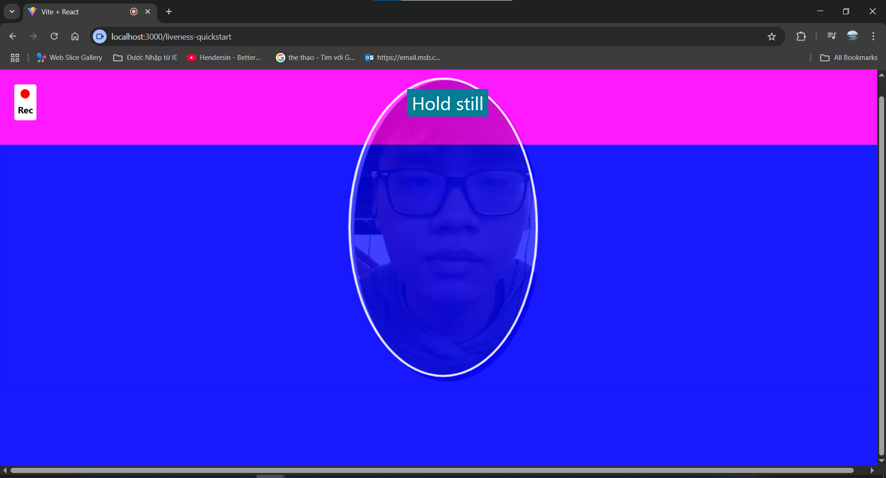

**Amazon Rekognition Face Liveness** is a managed AWS service that uses advanced machine learning to determine if a detected face is from a live person instead of a spoofed image, video, or mask.  
When paired with the **Amplify FaceLivenessDetector** component, it becomes straightforward to integrate liveness verification directly into your web or mobile application with minimal configuration.

Alongside liveness detection, **Amazon Rekognition CompareFaces** enables precise face matching between a captured image and one or more stored reference images in a **face collection**.  
For optimal performance, a collection should contain **at least two or three different faces** to ensure accurate comparison results and avoid false positives.

By combining these services, you gain several advantages over traditional face verification methods:

- **Real-time liveness verification** prevents spoof attacks using photos, videos, or masks.
- **High-accuracy face matching** through Rekognition CompareFaces, with similarity scoring to identify the best match.
- **Simple front-end integration** with Amplify UI components, reducing development time.
- **No need for custom ML model training**, as AWS handles the model lifecycle.
- **Scalable storage** for reference images using Amazon S3.
- **Seamless authentication** integration with Amazon Cognito for user management.
- **Serverless deployment** with AWS Lambda, reducing infrastructure costs.
- **Audit-friendly** — API calls and results can be logged for compliance purposes.

With these capabilities, Rekognition Face Liveness combined with Amplify FaceLivenessDetector and CompareFaces delivers a secure, accurate, and developer-friendly solution for identity verification in modern applications.

