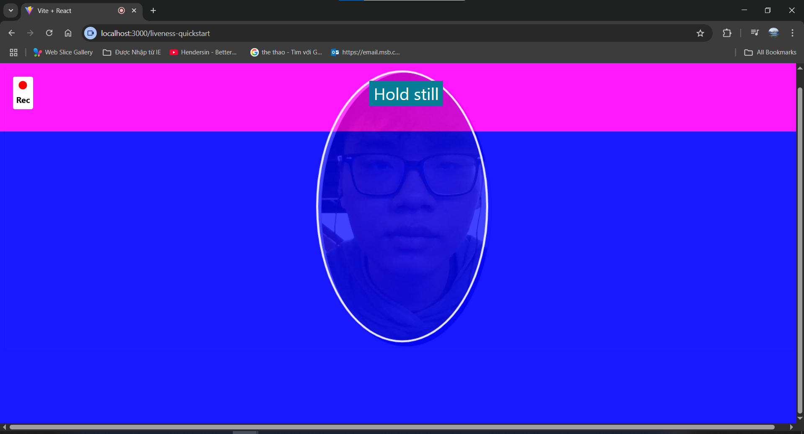

**Amazon Rekognition Face Liveness** là một dịch vụ AWS được quản lý sử dụng học máy tiên tiến để xác định liệu một khuôn mặt được phát hiện là từ một người thật thay vì một hình ảnh, video hoặc mặt nạ giả mạo (anti-spoofing).  
Khi kết hợp với thành phần **Amplify FaceLivenessDetector**, việc tích hợp xác minh người thật trực tiếp vào ứng dụng web hoặc di động của bạn trở nên đơn giản với cấu hình tối thiểu.

Bên cạnh phát hiện người thật, **Amazon Rekognition CompareFaces** cho phép so khớp khuôn mặt chính xác giữa một hình ảnh được chụp và một hoặc nhiều hình ảnh tham chiếu được lưu trữ trong một **collection khuôn mặt**.  
Để đạt hiệu suất tối ưu, một collection nên chứa **ít nhất hai hoặc ba khuôn mặt khác nhau** để đảm bảo kết quả so sánh chính xác và tránh dương tính giả.

Bằng cách kết hợp các dịch vụ này, bạn nhận được nhiều lợi thế so với các phương pháp xác minh khuôn mặt truyền thống:

- **Xác minh người thật thời gian thực** ngăn chặn các cuộc tấn công giả mạo sử dụng ảnh, video hoặc mặt nạ.
- **So khớp khuôn mặt độ chính xác cao** thông qua Rekognition CompareFaces, với điểm số tương đồng để xác định kết quả phù hợp nhất.
- **Tích hợp giao diện người dùng đơn giản** với các thành phần Amplify UI, giảm thời gian phát triển.
- **Không cần đào tạo mô hình ML tùy chỉnh**, vì AWS quản lý vòng đời mô hình.
- **Lưu trữ có thể mở rộng** cho hình ảnh tham chiếu sử dụng Amazon S3.
- **Tích hợp xác thực liền mạch** với Amazon Cognito để quản lý người dùng.
- **Triển khai không máy chủ** với AWS Lambda, giảm chi phí cơ sở hạ tầng.
- **Thân thiện với kiểm toán** — các cuộc gọi API và kết quả có thể được ghi lại cho mục đích tuân thủ.

Với những khả năng này, Rekognition Face Liveness kết hợp với Amplify FaceLivenessDetector và CompareFaces cung cấp một giải pháp xác minh danh tính an toàn, chính xác và thân thiện với nhà phát triển cho các ứng dụng hiện đại.

