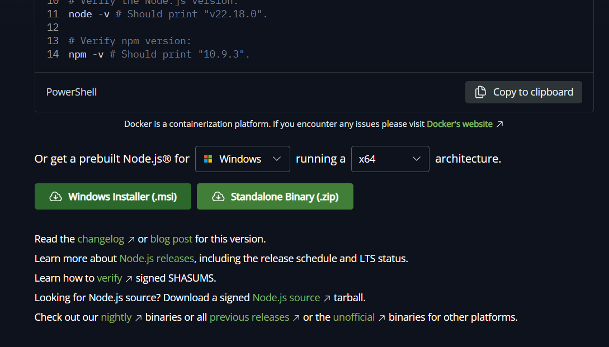
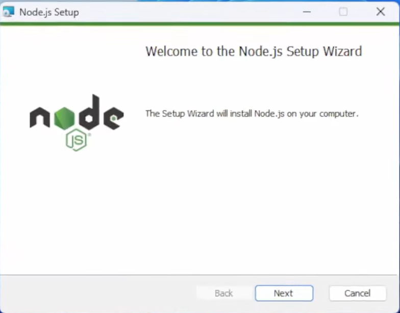
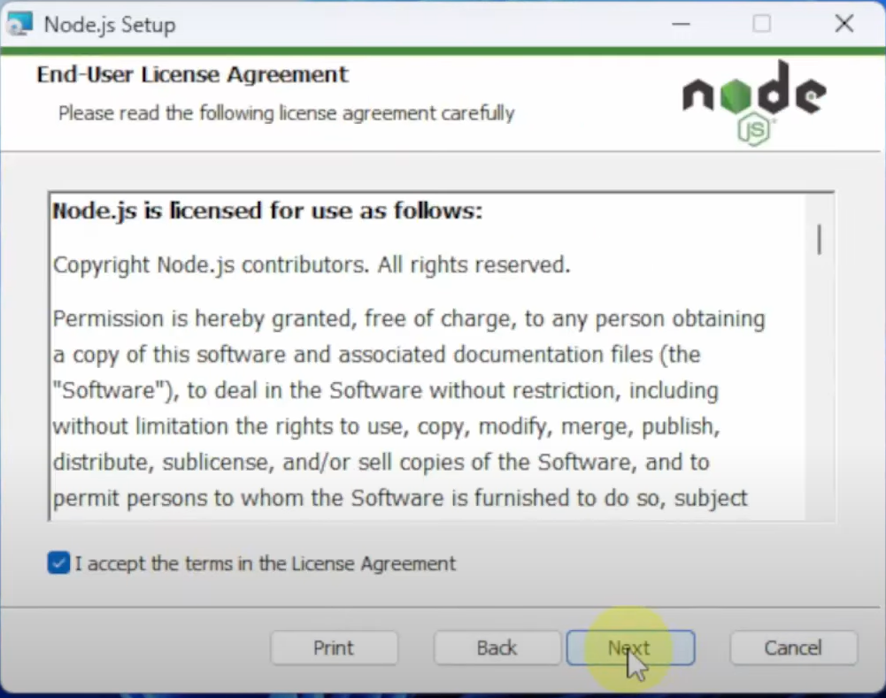
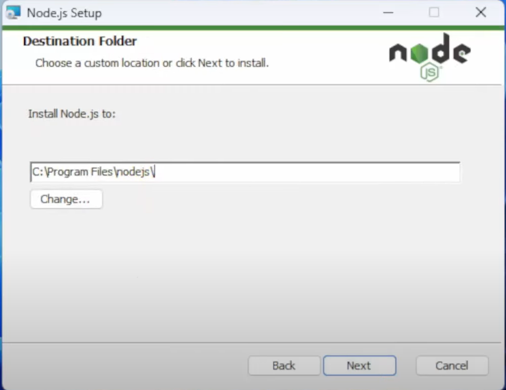
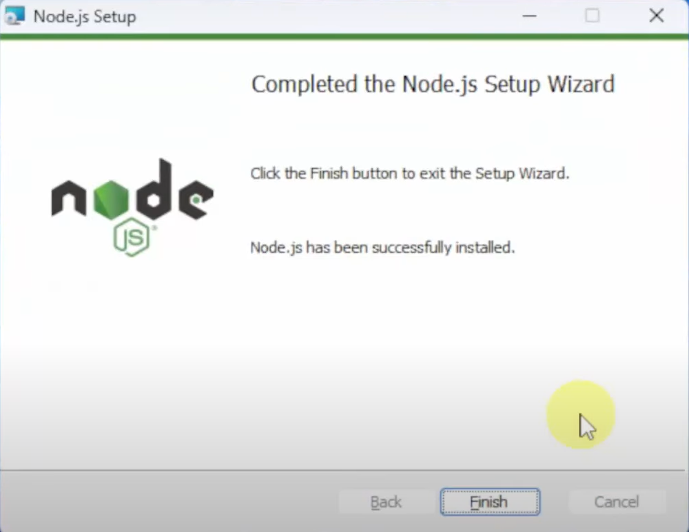

## Introduction

This page walks you through a **hands-on, GUI-style installation** of Node.js on **Windows** — the kind of instructions that say _"click Yes"_, _"choose folder"_, and _"Next → Next → Install"_. It assumes you want the **LTS (Long Term Support)** build for stability. Each step includes an image placeholder so you can drop in screenshots later.

> Note: If you use macOS or Linux, see the short notes at the end of this page (they’re quick CLI/pkging notes). This page focuses on the Windows installer UX.

---

## Before you start

- Download the **LTS** version from https://nodejs.org — LTS is recommended for most projects.
- Choose 64-bit unless you have a specific reason to use 32-bit.
- You will need **administrator** privileges to install to the default Program Files folder.
- Close terminal windows after installation so the new PATH is picked up.

---

## Step-by-step (Windows MSI installer)

### 1. Download Node.js (LTS)

1. Open your browser and go to: `https://nodejs.org/`
2. Click the button (Windows Installer `.msi`).  
   

---

### 2. Run the installer

1. Double-click the downloaded `.msi` file (usually in your `Downloads` folder).

---

### 3. Welcome screen

1. The installer shows a welcome panel. Click **Next** to continue.  
   

---

### 4. License agreement

1. Read (or skim) the license.
2. Select **I accept the terms in the License Agreement** and click **Next**.  
   **Image placeholder:**  
   

---

### 5. Choose destination folder

1. The installer suggests a default folder (e.g. `C:\Program Files\nodejs\`).
2. If you want a custom location click **Change...** and pick a folder; otherwise accept the default and click **Next**.  
   **Tip:** Install to Program Files unless you have a good reason not to.  
   

---

### 6. Custom setup / Components

1. Keep **Node.js runtime** and **npm package manager** selected (they are by default).
2. Ensure the option to **Add to PATH** is enabled (usually automatic).
3. Optionally enable any extras like documentation or context menu entries.
4. Click **Next**.  
   

---

### 7. Install

1. Click **Install** to begin.
2. Wait while files are copied. If UAC prompts again, click **Yes**.

---

### 8. Finish

1. When the installer completes, click **Finish**.
2. Optionally check any post-install toolboxes the installer offers (for example “Automatically install required tools” — optional).  
    **Image placeholder:**  
   

---

### 9. Verify installation

1. Open **Command Prompt** or **PowerShell** (open a new window).
2. Run:
   ```bash
   node -v
   npm -v
   ```
