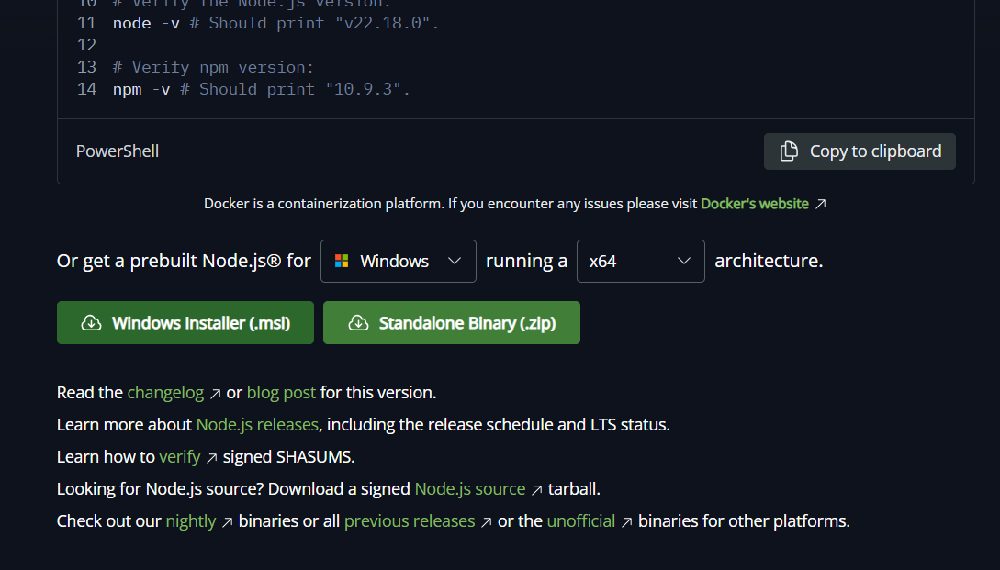
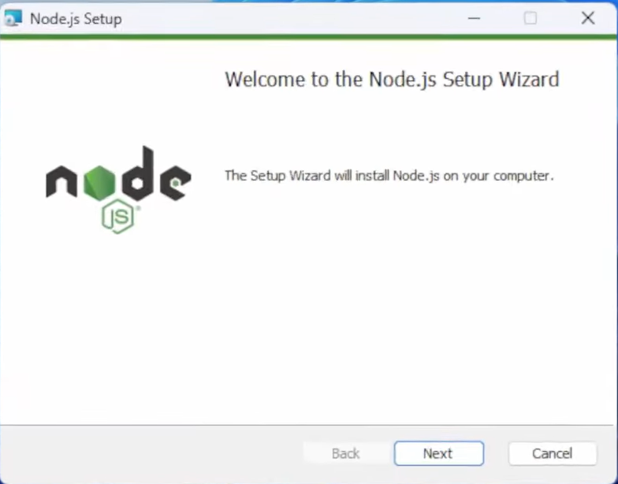
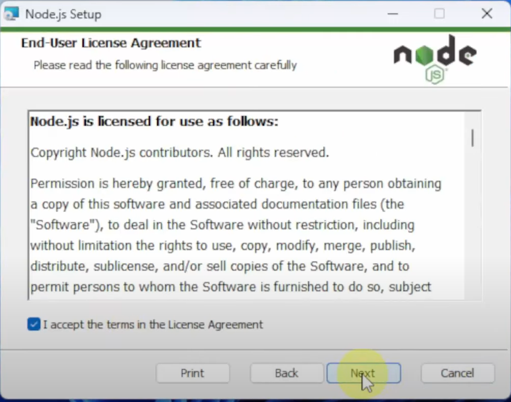
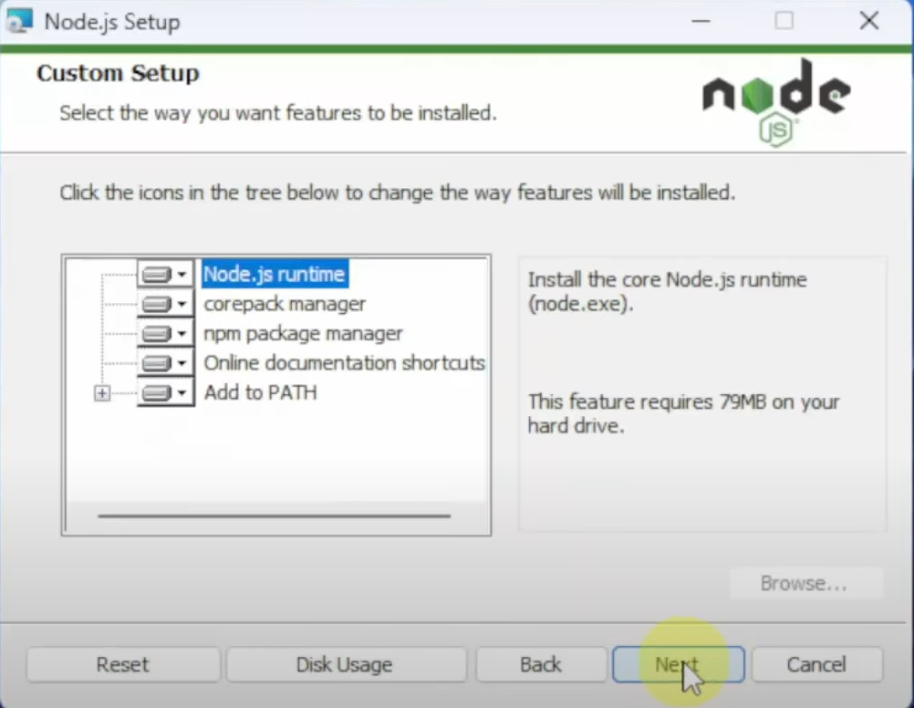

## Giới thiệu

Trang này hướng dẫn bạn qua quy trình **cài đặt thực hành, theo giao diện đồ họa** của Node.js trên **Windows** — kiểu hướng dẫn chi tiết như _"nhấn Có"_, _"chọn thư mục"_, và _"Tiếp theo → Tiếp theo → Cài đặt"_. Tài liệu giả định bạn muốn sử dụng phiên bản **LTS (Hỗ trợ Dài hạn)** để đảm bảo tính ổn định. Mỗi bước bao gồm một vị trí giữ chỗ hình ảnh để bạn có thể thêm ảnh chụp màn hình sau này.

> Lưu ý: Nếu bạn sử dụng macOS hoặc Linux, xem các ghi chú ngắn ở cuối trang này (chúng là các ghi chú nhanh về CLI/gói). Trang này tập trung vào trải nghiệm người dùng cài đặt trên Windows.

---

## Trước khi bắt đầu

- Tải xuống phiên bản **LTS** từ https://nodejs.org — phiên bản LTS được khuyến nghị cho hầu hết các dự án.
- Chọn phiên bản 64-bit trừ khi bạn có lý do cụ thể để sử dụng 32-bit.
- Bạn sẽ cần quyền **quản trị viên** để cài đặt vào thư mục Program Files mặc định.
- Đóng các cửa sổ dòng lệnh sau khi cài đặt để PATH mới được cập nhật.

---

## Hướng dẫn từng bước (Trình cài đặt MSI Windows)

### 1. Tải xuống Node.js (LTS)

1. Mở trình duyệt và truy cập: `https://nodejs.org/`
2. Nhấn vào nút (Trình cài đặt Windows `.msi`).  
   

---

### 2. Chạy trình cài đặt

1. Nhấp đúp vào tệp `.msi` đã tải xuống (thường nằm trong thư mục `Downloads` của bạn).

---

### 3. Màn hình chào mừng

1. Trình cài đặt hiển thị một bảng chào mừng. Nhấn **Tiếp theo** để tiếp tục.  
   

---

### 4. Thỏa thuận giấy phép

1. Đọc (hoặc xem lướt) giấy phép.
2. Chọn **Tôi chấp nhận các điều khoản trong Thỏa thuận Giấy phép** và nhấn **Tiếp theo**.  
   **Vị trí giữ chỗ hình ảnh:**  
   

---

### 5. Chọn thư mục đích

1. Trình cài đặt đề xuất một thư mục mặc định (ví dụ: `C:\Program Files\nodejs\`).
2. Nếu muốn thay đổi vị trí, nhấn **Thay đổi...** và chọn một thư mục; nếu không, chấp nhận mặc định và nhấn **Tiếp theo**.  
   **Mẹo:** Cài đặt vào Program Files trừ khi bạn có lý do chính đáng để không làm như vậy.  
   

---

### 6. Thiết lập tùy chỉnh / Thành phần

1. Giữ nguyên các tùy chọn **Node.js runtime** và **trình quản lý gói npm** được chọn (mặc định đã chọn).
2. Đảm bảo tùy chọn **Thêm vào PATH** được kích hoạt (thường là tự động).
3. Tùy chọn kích hoạt các tính năng bổ sung như tài liệu hoặc mục nhập menu ngữ cảnh.
4. Nhấn **Tiếp theo**.  
   

---

### 7. Cài đặt

1. Nhấn **Cài đặt** để bắt đầu.
2. Chờ trong khi các tệp được sao chép. Nếu UAC hiển thị lại, nhấn **Có**.

---

### 8. Hoàn tất

1. Khi trình cài đặt hoàn tất, nhấn **Hoàn tất**.
2. Tùy chọn kiểm tra bất kỳ hộp công cụ sau cài đặt nào mà trình cài đặt cung cấp (ví dụ: “Tự động cài đặt các công cụ cần thiết” — tùy chọn).  
    **Vị trí giữ chỗ hình ảnh:**  
   

---

### 9. Xác minh cài đặt

1. Mở **Dòng lệnh** hoặc **PowerShell** (mở một cửa sổ mới).
2. Chạy:
   ```bash
   node -v
   npm -v
   ```
