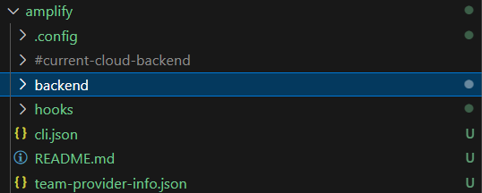

## Setting Up project and AWS Amplify with Face Liveness Detection

This guide walks you through setting up **Amplify Auth** and the **FaceLivenessDetector** component to perform AWS Rekognition Face Liveness checks in your React application.

---

## Project clone and introduction

## Step 1 — Clone the Rekognition Project

First, clone the repository from GitHub to your local machine:

```bash
git clone https://github.com/sang-ute/rekognition-project.git
```

Navigate into the project directory:

```bash
cd rekognition-project

```

Step 2 — Install Root Project Dependencies
Install the dependencies for the root project using npm:

```bash
npm install
```

This sets up all the necessary dependencies listed in the root package.json.

Step 3 — Install Frontend Dependencies
Switch to the frontend directory and install its dependencies:

```bash
cd frontend
```

```bash
npm install
```

This installs everything required for the frontend part of the project to run.

{}
It's best not to start project without having a look at the package.json, go ahead and see what's in the tech stack of this project (really)
{}

## 1. Install Amplify to project

The **Amplify CLI** is required to initialize and manage your Amplify backend.

> **Note:** FaceLivenessDetector uses **Amplify Auth** by default to authorize users for the liveness check. If you’re new to Amplify, install the CLI first.

---

## 2. Initialize a New Amplify Project

Run:

```bash
amplify init
```

**First**, choose gen 1 since they'll create you the Cognito user pool, which will be useful for accessing Amplify Auth. Then, choose the default options for the project name, environment, and access type.


Next, choose the reason for using gen 1, if you can manually set up gen 2, it's best to choose it.


Follow the prompts (or if you have a framework outside Vite React, you can modify the Framework):

```
? Enter a name for the project: rekognition
? Enter a name for the environment: dev
? Choose your default editor: Visual Studio Code
? App type: javascript
? What javascript framework are you using: none
? Source Directory Path: src
? Distribution Directory Path: dist
? Build Command: npm run-script build
? Start Command: npm run-script start
```


But, you don't need to create anything, since the project already has the necessary files.

## 3. Add Amplify Auth

First, choose the Profile (or if you have access key of the IAM, you can pick the access key option, both are fine)


This is for the Access Key option (IAM user with amplify and rekognition access, for more on how to do it properly, scroll down on **4.Update IAM Role Permissions**)


Then, click enter of the profile you created, it will initialize the project file.


Then, the configuration files of amplify are set, you're good to go!


After that, you can re-create the backend or frontend of this project, but we'll not going through that now.



Choose:

- **Manual configuration**
- **User Sign-Up, Sign-In, connected with AWS IAM controls**
- Friendly name:
- Identity pool name:
- Allow unauthenticated logins:
- Accept defaults for the rest

## 4. Update IAM Role Permissions

You must allow authenticated or unauthenticated users to access Rekognition (**or you can use the based profile you have been doing in the preperation step**).

{}
It's best practise for each service to have its own IAM role. This is because you can easily remove access to a service if you need to. But for simplicity, we will use the same IAM role for both Rekognition and Amplify Auth and the whole project.
{}

1. Go to **AWS IAM Console → Roles**
2. Select:

   - `unauthRole` (if no login required - **which is our project is building**), or
   - `authRole` (**if using authentication like OAuth or others**)


3. Scroll down and choose **Add Permissions**


**Click to Create Inline Policy**


4. Select **JSON** and paste:

```json
{
  "Version": "2012-10-17",
  "Statement": [
    {
      "Effect": "Allow",
      "Action": "rekognition:StartFaceLivenessSession",
      "Resource": "*"
    }
  ]
}
```


5. Click "Save"


5. Review, name the policy, and create the policy.


6. Wait and see the new policy has been set

## 

## 5. Install UI Dependencies

- Since the first npm install will block or doesn't allow those package to install because of "deprecated reasons".

```bash
npm install @aws-amplify/ui-react-liveness aws-amplify
```

## 6. Next Steps

To fully enable Face Liveness Detection:

- Configure our DynamoDB first

- Run the project locally

- And if you want to make it serverless, there's more tasks ahead!!!

### Serverless website

- Build backend APIs to:

  - Create sessions (`StartFaceLivenessSession`)
  - Retrieve results (`GetFaceLivenessSessionResults`)

- Integrate with your authentication & authorization flow
- Test in your preferred AWS region
  {}
  If you are using a different AWS region, you will need to update the region in your AWS CLI configuration and in your code. You can do this by running `aws configure` and following the prompts to enter.
  {}
