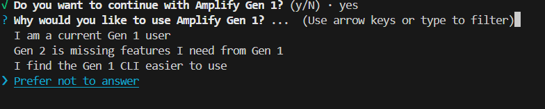
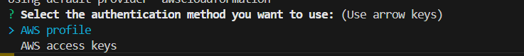
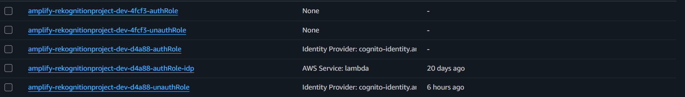
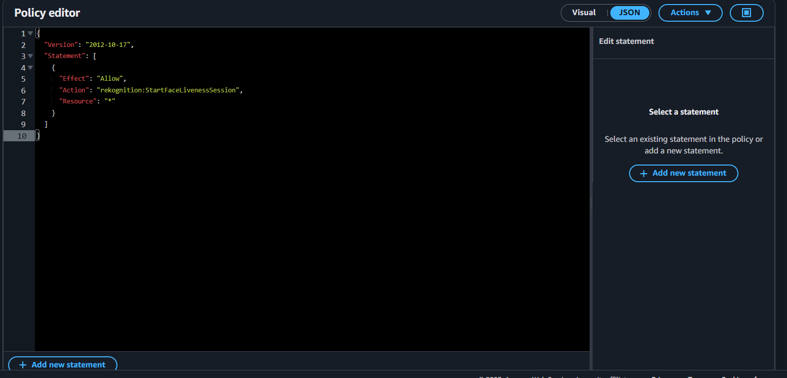
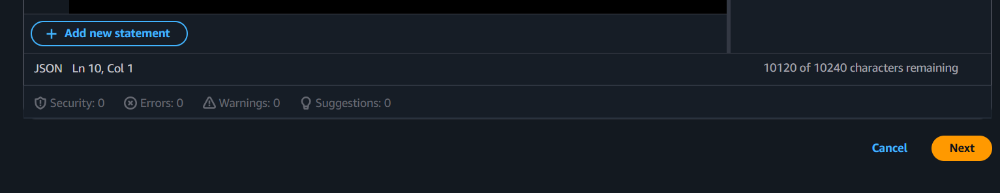

## Thiết lập dự án và AWS Amplify với phát hiện người thật

Hướng dẫn này sẽ dẫn bạn qua các bước thiết lập **Amplify Auth** và thành phần **FaceLivenessDetector** để thực hiện kiểm tra người thật của AWS Rekognition trong ứng dụng React của bạn.

---

## Sao chép dự án và giới thiệu

### Bước 1 — Sao chép dự án Rekognition

Trước tiên, sao chép kho lưu trữ từ GitHub về máy cục bộ của bạn:

```bash
git clone https://github.com/sang-ute/rekognition-project.git
```

Điều hướng vào thư mục dự án:

```bash
cd rekognition-project
```

### Bước 2 — Cài đặt phụ thuộc dự án gốc

Cài đặt các phụ thuộc cho dự án gốc bằng npm:

```bash
npm install
```

Lệnh này thiết lập tất cả các phụ thuộc cần thiết được liệt kê trong tệp package.json gốc.

### Bước 3 — Cài đặt phụ thuộc giao diện người dùng

Chuyển đến thư mục giao diện và cài đặt các phụ thuộc của nó:

```bash
cd frontend
```

```bash
npm install
```

Lệnh này cài đặt mọi thứ cần thiết để phần giao diện của dự án hoạt động.

{}
Tốt nhất không nên bắt đầu dự án mà không xem qua tệp package.json, hãy kiểm tra xem công nghệ nào được sử dụng trong dự án này (thực sự cần thiết).
{}

## 1. Cài đặt Amplify vào dự án

**Amplify CLI** là cần thiết để khởi tạo và quản lý hậu cảnh Amplify của bạn.

> **Lưu ý:** FaceLivenessDetector sử dụng **Amplify Auth** theo mặc định để xác thực người dùng cho kiểm tra người thật. Nếu bạn mới sử dụng Amplify, hãy cài đặt CLI trước.

---

## 2. Khởi tạo dự án Amplify mới

Chạy:

```bash
amplify init
```

**Đầu tiên**, chọn gen 1 vì nó sẽ tạo cho bạn một nhóm người dùng Cognito, hữu ích cho việc truy cập Amplify Auth. Sau đó, chọn các tùy chọn mặc định cho tên dự án, môi trường, và loại truy cập.


Tiếp theo, chọn lý do sử dụng gen 1, nếu bạn có thể thiết lập gen 2 thủ công, tốt nhất nên chọn nó.



Làm theo các hướng dẫn (hoặc nếu bạn sử dụng một khung công tác ngoài Vite React, bạn có thể sửa đổi Framework):

```
? Nhập tên cho dự án: rekognition
? Nhập tên cho môi trường: dev
? Chọn trình chỉnh sửa mặc định: Visual Studio Code
? Loại ứng dụng: javascript
? Khung công tác JavaScript bạn đang sử dụng: none
? Đường dẫn thư mục nguồn: src
? Đường dẫn thư mục phân phối: dist
? Lệnh xây dựng: npm run-script build
? Lệnh khởi động: npm run-script start
```


Tuy nhiên, bạn không cần tạo bất kỳ thứ gì, vì dự án đã có các tệp cần thiết.

## 3. Thêm Amplify Auth

Đầu tiên, chọn hồ sơ (hoặc nếu bạn có khóa truy cập của IAM, bạn có thể chọn tùy chọn khóa truy cập, cả hai đều được).


Đây là tùy chọn khóa truy cập (người dùng IAM với quyền truy cập Amplify và Rekognition, để biết thêm cách thực hiện đúng cách, cuộn xuống phần **4. Cập nhật quyền vai trò IAM**).



Sau đó, nhấn Enter với hồ sơ bạn đã tạo, nó sẽ khởi tạo tệp dự án.


Sau đó, các tệp cấu hình của Amplify được thiết lập, bạn đã sẵn sàng!


Sau đó, bạn có thể tái tạo hậu cảnh hoặc giao diện của dự án này, nhưng chúng ta sẽ không đi sâu vào đó bây giờ.


Chọn:

- **Cấu hình thủ công**
- **Đăng ký người dùng, đăng nhập, kết nối với kiểm soát AWS IAM**
- Tên thân thiện:
- Tên nhóm danh tính:
- Cho phép đăng nhập không xác thực:
- Chấp nhận các giá trị mặc định cho phần còn lại

## 4. Cập nhật quyền vai trò IAM

Bạn phải cho phép người dùng xác thực hoặc không xác thực truy cập Rekognition (**hoặc bạn có thể sử dụng hồ sơ cơ bản mà bạn đã thực hiện trong bước chuẩn bị**).

{}
Thực hành tốt nhất là mỗi dịch vụ nên có vai trò IAM riêng. Điều này giúp bạn dễ dàng xóa quyền truy cập vào một dịch vụ nếu cần. Nhưng để đơn giản, chúng ta sẽ sử dụng cùng một vai trò IAM cho cả Rekognition và Amplify Auth cũng như toàn bộ dự án.
{}

1. Truy cập **Bảng điều khiển IAM AWS → Vai trò**
2. Chọn:

   - `unauthRole` (nếu không yêu cầu đăng nhập - **đây là dự án chúng ta đang xây dựng**), hoặc
   - `authRole` (**nếu sử dụng xác thực như OAuth hoặc khác**)



3. Cuộn xuống và chọn **Thêm quyền**


**Nhấn để tạo chính sách nội tuyến**


4. Chọn **JSON** và dán:

```json
{
  "Version": "2012-10-17",
  "Statement": [
    {
      "Effect": "Allow",
      "Action": "rekognition:StartFaceLivenessSession",
      "Resource": "*"
    }
  ]
}
```



5. Nhấn "Lưu"



6. Xem xét, đặt tên cho chính sách, và tạo chính sách.


7. Chờ và kiểm tra chính sách mới đã được thiết lập

## 

## 5. Cài đặt phụ thuộc giao diện người dùng

- Vì lệnh npm install đầu tiên sẽ chặn hoặc không cho phép cài đặt các gói này do lý do "bị deprecated".

```bash
npm install @aws-amplify/ui-react-liveness aws-amplify
```

## 6. Các bước tiếp theo

Để kích hoạt hoàn toàn phát hiện người thật:

- Cấu hình DynamoDB trước tiên

- Chạy dự án cục bộ

- Và nếu bạn muốn biến nó thành serverless, còn nhiều nhiệm vụ phía trước!!!

### Trang web serverless

- Xây dựng các API hậu cảnh để:

  - Tạo phiên (`StartFaceLivenessSession`)
  - Lấy kết quả (`GetFaceLivenessSessionResults`)

- Tích hợp với luồng xác thực & ủy quyền của bạn
- Kiểm tra trong khu vực AWS bạn ưu tiên
  {}
  Nếu bạn sử dụng một khu vực AWS khác, bạn cần cập nhật khu vực trong cấu hình AWS CLI và trong mã của bạn. Bạn có thể thực hiện điều này bằng cách chạy `aws configure` và làm theo các hướng dẫn để nhập.
  {}
