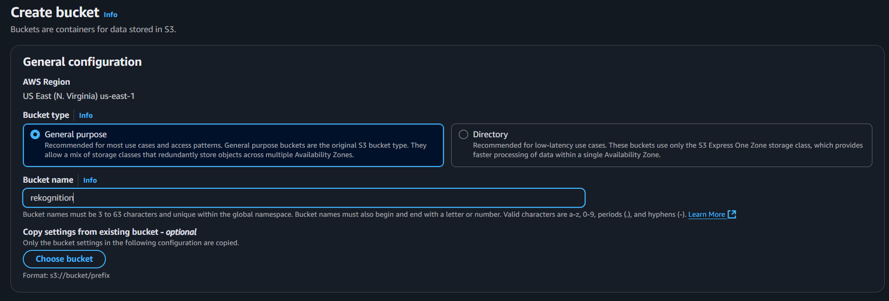
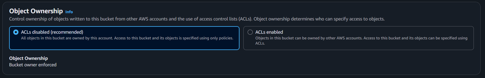
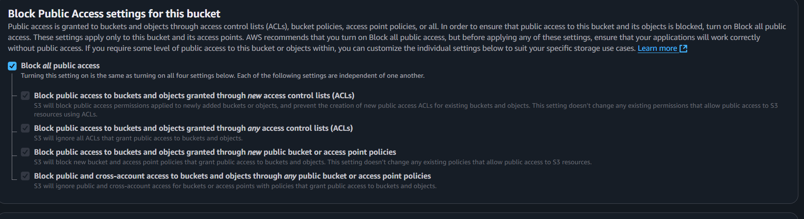
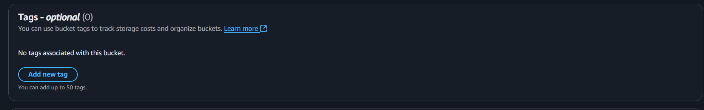
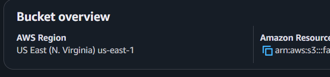
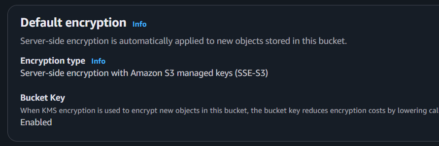

## S3 BUCKET CREATION & CONFIGURATION

### 1. **Create S3 Bucket**

Go to: https://s3.console.aws.amazon.com/s3/home


Click **Create bucket**, and fill in:

### ▸ **AWS Region**:

- Choose your preferred (same as in your **AWS profile**), e.g.,
  `us-east-1`
  

  {}
  If you are using a different AWS region, you will need to update the region in the AWS Management Console on the upper right, next to Account ID
  {}

### ▸ **Bucket type**:

- Choose "General purpose"

### ▸ **Bucket name**:

- Use lowercase, no spaces.
- Example: `face-recognition-users`
- Remember the bucket name



### 2. **Object Ownership**

This affects whether objects uploaded by others are owned by you (the bucket owner)

**Recommended Setting**:

- Choose: **ACLs disabled** (Bucket owner enforced) → safest & preferred
- Why: Prevents cross-account issues and ensures the bucket owner owns all uploaded files.

---



### 3. **Block Public Access Settings**

This determines if objects can be made public.

\*Recommended Setting\*\* (FOR PRIVATE FACE DATA):

- Leave all **4 checkboxes checked** (default)
  - Block all public access
  - Block public ACLs
  - Block public bucket policies
  - Restrict public buckets

📌 Why? You **do not** want anyone from the internet accessing user face images.



> If testing requires public access temporarily, you can unblock later, but always re-enable for production.

---

### 4. **Bucket Versioning**

This stores multiple versions of the same file.

- **Recommended**: **Disable**
- Unless you need to track changes or deletions, versioning is unnecessary and costs more.


---

### 5. **Default Encryption**

Encrypts objects at rest.


**Recommended**: **Enable**

- Select: **S3-managed keys (SSE-S3)** → simplest and still secure
- Or, for more control: **AWS KMS keys (SSE-KMS)** → for regulated environments

📌 Encryption helps protect sensitive facial data.

---

### 6. **Advanced Settings**

You can skip most of this unless needed for logging or replication.
**Tags**: Not needed now (optional for cost tracking)



**Object Locking**: Leave disabled unless you need WORM (write once, read many)


Final Step: Create Bucket

Click **"Create bucket"** to finish.


---

### Post-Setup Checks

1. **Permissions tab**:
   - Ensure **"Block all public access"** is still enabled.


2. **Properties tab**:
   - Confirm encryption and region are correct.





3. **Upload test file** (optional):
   - Upload a face image into a `faces/` folder (optional organization).

---

### Summary for Face Rekognition Use Case

| Setting             | Value                            |
| ------------------- | -------------------------------- |
| Object Ownership    | Bucket owner enforced (ACLs off) |
| Block Public Access | All checked                      |
| Versioning          | Disabled                         |
| Encryption          | SSE-S3                           |
| Bucket Name         | your_s3_name                     |
| Folder (optional)   | faces/                           |

## STEP 2: Set Up `.env`

Create a `.env` file in your project folder (or like the .env.example in the clone project of this workshop, the others env like Dynamo can be build later in this workshop):

```
AWS_REGION=us-east-1 #or the region specified that you selected
S3_BUCKET=your-bucket-name
REKOGNITION_COLLECTION= your-collection-name
```
