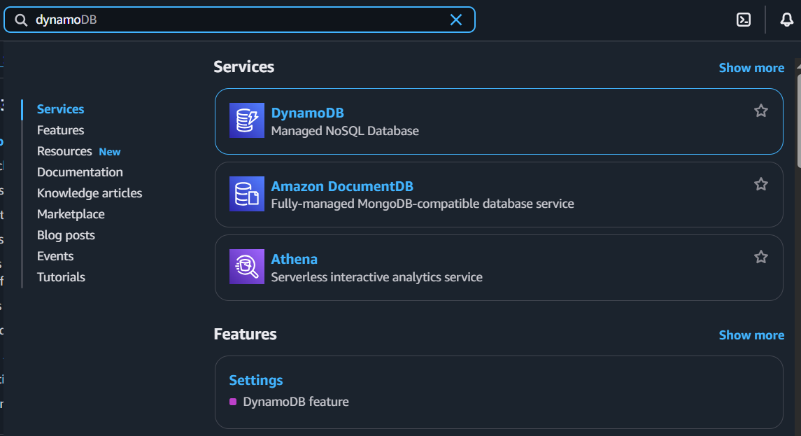
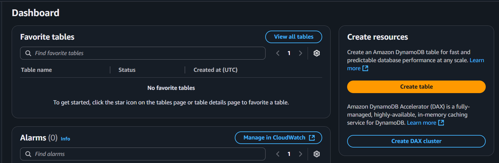
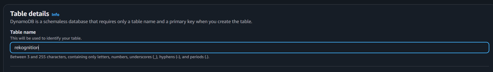
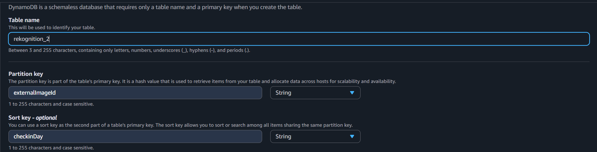
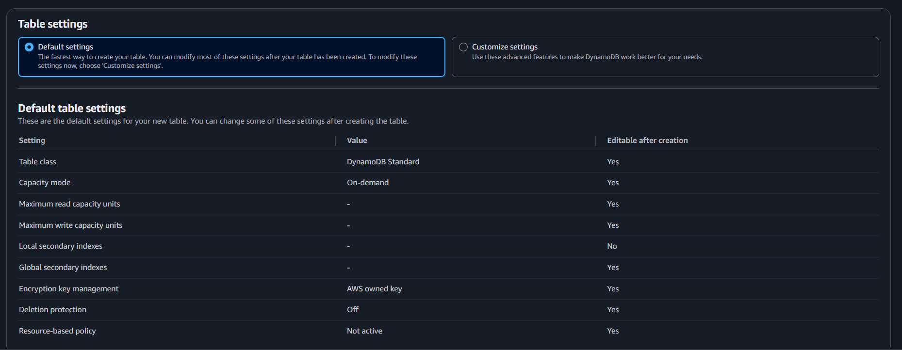
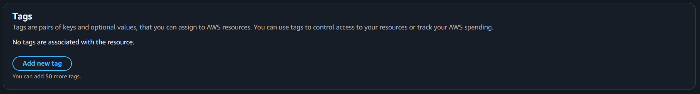
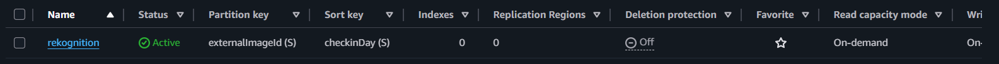

{}
This DynamoDB setup is going to store for the /attendance as well as /list-collection path, make sure you configure carefully for best result
{}

Got it — here’s a **Hugo-style, step-by-step guide** for creating a DynamoDB table using the AWS Management Console **and** AWS CLI, with placeholders for screenshots so you can add them later.

---

## Creating a DynamoDB Table

Amazon DynamoDB is a fully managed NoSQL database service that provides fast and predictable performance with seamless scalability. This guide walks you through creating a DynamoDB table from scratch.

---

### **1. Sign in to AWS Management Console**

1. Open [AWS Management Console](https://console.aws.amazon.com/).
2. In the **Search bar**, type **"DynamoDB"** and select it.

---

### **2. Start Table Creation**

1. Click **Create table**.

## 

### **3. Define Table Name and Primary Key**

1. **Table name** – Enter a descriptive name for your table (e.g., `Users` or `Orders`).

2. **Partition key** – Enter a primary key attribute name (For this project is `checkinDay`) and select its type (String).

3. Add a **Sort key** a composite primary key.

---

### **4. Configure Table Settings**

1. Choose **Table settings**:

- Choose default settings

2. Set **Tags**:

- You can set tags if you want to manage your budget and AWS resources.

---

### **5. Create the Table**

1. Click **Create table**.

   

2. Wait until the **Status** changes to `Active`.

---

{}
For detailed pricing and best practices, see the [Amazon DynamoDB Documentation](https://docs.aws.amazon.com/amazondynamodb/latest/developerguide/).
{}
