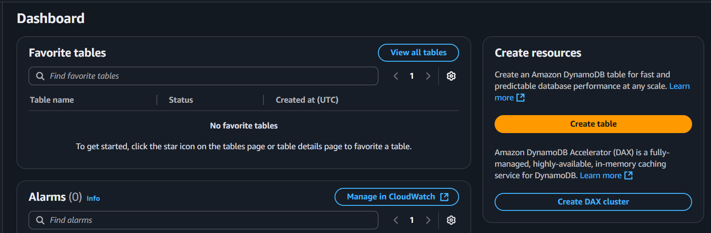
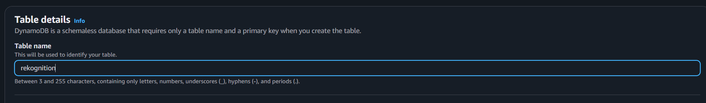
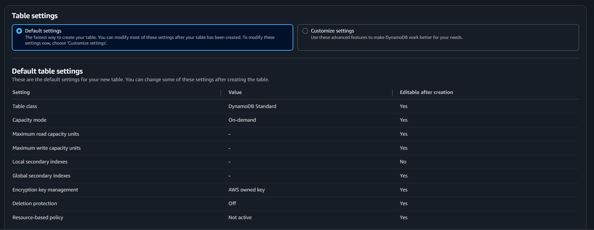
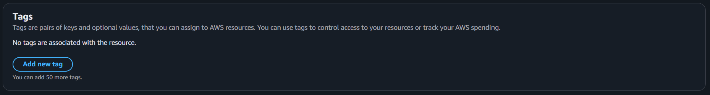
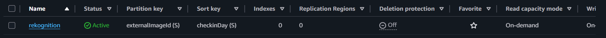

{}
Thiết lập DynamoDB này sẽ lưu trữ dữ liệu cho đường dẫn /attendance cũng như /list-collection, hãy đảm bảo cấu hình cẩn thận để đạt kết quả tốt nhất.
{}

Dưới đây là **hướng dẫn theo kiểu Hugo, từng bước** để tạo một DynamoDB Table bằng AWS Management Console **và** AWS CLI, với các vị trí giữ chỗ cho ảnh chụp màn hình để bạn có thể thêm sau này.

---

## Tạo DynamoDB Table

Amazon DynamoDB là một dịch vụ cơ sở dữ liệu NoSQL được quản lý hoàn toàn, cung cấp hiệu suất nhanh và dự đoán được với khả năng mở rộng liền mạch. Hướng dẫn này sẽ dẫn bạn qua các bước tạo một DynamoDB Table từ đầu.

---

### **1. Đăng nhập vào AWS Management Console**

1. Mở [AWS Management Console](https://console.aws.amazon.com/).
2. Trong **thanh tìm kiếm**, nhập **"DynamoDB"** và chọn nó.

---

### **2. Bắt đầu tạo Table**

1. Nhấn **Create table**.

## 

### **3. Xác định Table Name và Primary Key**

1. **Table name** – Nhập một tên mô tả cho Table của bạn (ví dụ: `Users` hoặc `Orders`).

2. **Partition key** – Nhập tên thuộc tính khóa chính (Đối với dự án này là `checkinDay`) và chọn loại của nó (String).

3. Thêm một **Sort key** để tạo composite primary key.

---

### **4. Cấu hình Table Settings**

1. Chọn **Table settings**:

- Chọn default settings

2. Thiết lập **Tags**:

- Bạn có thể thiết lập tags nếu muốn quản lý ngân sách và tài nguyên AWS.

---

### **5. Tạo Table**

1. Nhấn **Create table**.

   

2. Chờ cho đến khi **Status** chuyển thành `Active`.

---

{}
Để biết chi tiết về giá cả và thực tiễn tốt nhất, xem [Amazon DynamoDB Documentation](https://docs.aws.amazon.com/amazondynamodb/latest/developerguide/).
{}
