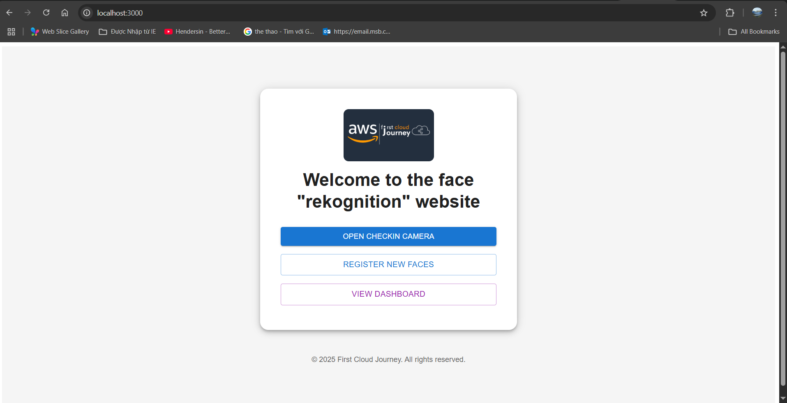
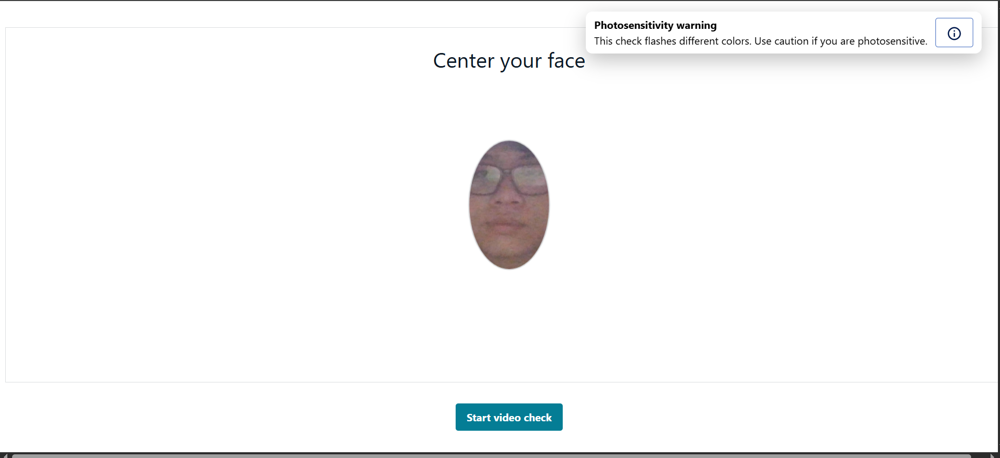
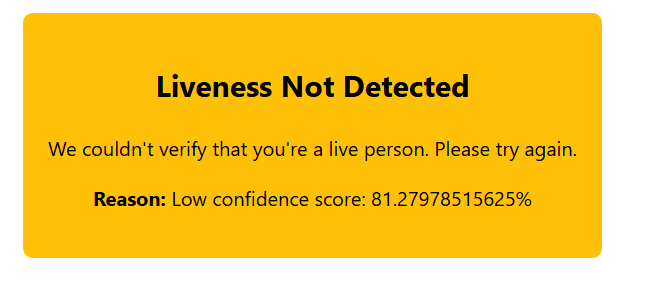
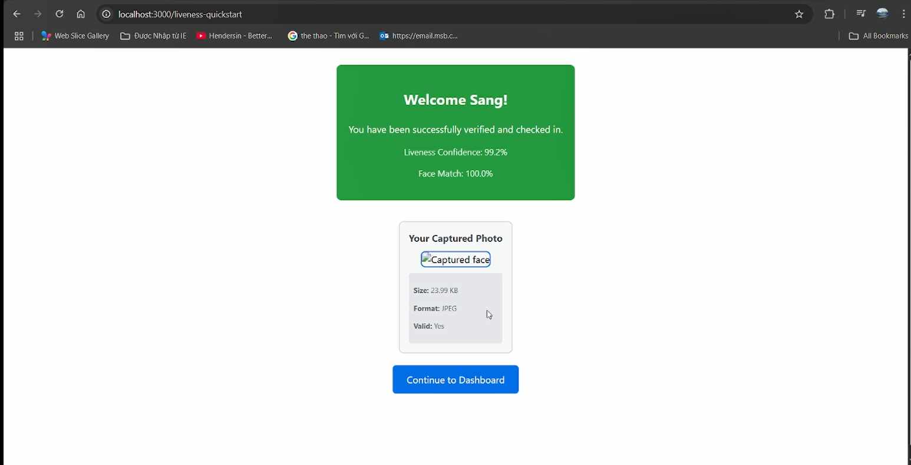
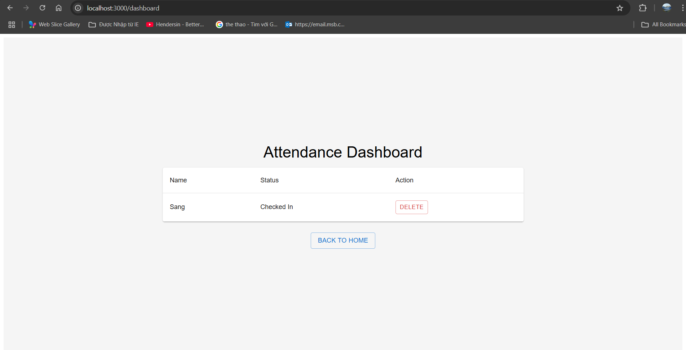

## Overview

Once all AWS services and environment variables have been set up, you can start the project locally for testing and development.  
This step will launch a Vite development server that serves the frontend application.

---

## Step 0: Update your .env

- Your .env file in the project root should contain all the AWS service configuration values required for the backend to connect to Rekognition, S3, and DynamoDB.

Example .env.examle (project folder already provided)

```bash
AWS_ACCESS_KEY_ID=YOUR_AWS_ACCESS_KEY_ID
AWS_SECRET_ACCESS_KEY=YOUR_AWS_SECRET
AWS_REGION=us-east-1
S3_BUCKET=YOUR_S3_BUCKET_NAME
REKOGNITION_COLLECTION=YOUR_REKOGNITION_COLLECTION_NAME
DYNAMO_TABLE=YOUR_DYNAMO_TABLE_NAME
```

**Why these matter:**

- AWS_ACCESS_KEY_ID / AWS_SECRET_ACCESS_KEY → IAM credentials to access AWS services

- AWS_REGION → AWS region code (e.g., us-east-1 for N. Virginia)

- S3_BUCKET → Name of the S3 bucket storing your face images

- REKOGNITION_COLLECTION → Rekognition collection ID you created earlier

- DYNAMO_TABLE → DynamoDB table name for storing metadata

### Frontend .env

- The frontend (inside frontend/) often needs its own .env file so Vite can inject variables at build time.

Example .env (frontend)

```
VITE_API_BASE_URL=http://localhost:3001
```

{}
You only need to know that this is here. If you wanted to proceed without deploying serverless, you can skip this
{}

## Step 1 – Navigate to the Frontend Directory

Move into the **frontend** directory:

```bash
cd frontend
```

## Step 2 – Start the Development Server

Run:

```bash
npm run dev
```

You should see output similar to:

```
> frontend@0.0.0 dev
> vite

  VITE v5.4.19  ready in xxx ms

  ➜  Local:   http://localhost:3000/
  ➜  Network: use --host to expose
  ➜  press h + enter to show help

```

Open the **Local** link in your browser to start using the app.


From here, the flow is going accordingly:

- You first have to register a face via your image (make sure your image is clear and your face is close enough to the photo you uploaded)
- Then, navigate to the "Open checkin camera" to view the checkin session.



- Next, start and checking in, following the instructions:


- Next, a beam of colors will flash at you, you will have to hold still for it to capture your face


- If you move too far or not in the frame, the system will notify you like this:



- Else, it would show your name as well as your image (this feature is yet to deploy)



- Then, navigate to dashboard, you can see it's checked in for my face among all faces in the system.



## Troubleshooting

If the application does not start or behaves unexpectedly, check the following:

1. **Backend API URL**

   - Open `frontend/src/config/axios.js`
   - Ensure the backend route is correct:

     ```javascript
     baseURL: import.meta.env.VITE_API_BASE_URL || "http://localhost:3001",
     ```

   - If your backend is running on a different port or domain, update this accordingly.

2. **Missing Dependencies**

   - Sometimes, `npm install` may not add all packages due to Amplify's deprecated dependencies (which this workshop will be in a short time, Amplify is changing everyday).
   - In this case, run:

     ```bash
     npm install --force
     ```

     Do this **both** in the `frontend` folder and in the **project root**.

3. **Amplify Configuration Files**

   - Check for the presence of:

     - `frontend/src/aws-exports.js`
     - `frontend/src/amplifyconfiguration.json`

   - If these files are missing or have incorrect values, revisit the **Amplify setup step** from the workshop to regenerate them.

{}
If changes are made to `.env` or AWS configuration files while the dev server is running, Vite will automatically restart the server.
{}

### Are you ready to make it serverless?

- If yes, we continue with 7. Deploying Lambda functions and API Gateway

- If not, you can navigate to "Clean up resources"
