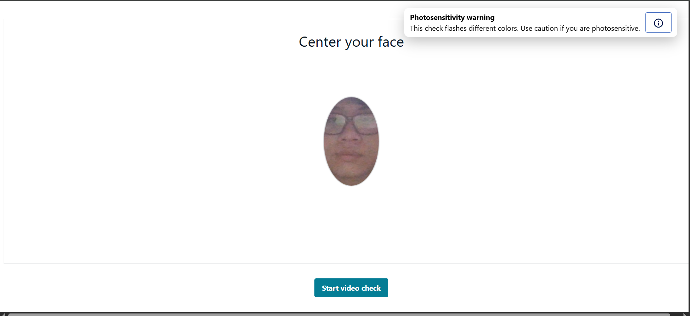
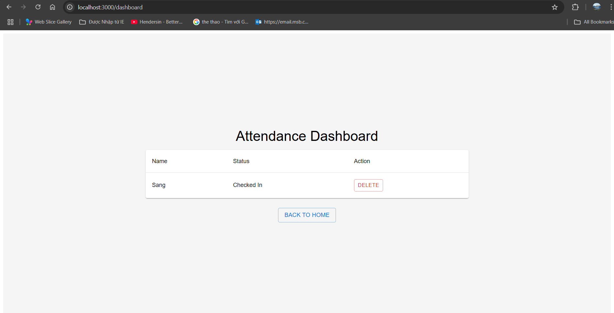

## Tổng quan

Sau khi tất cả các dịch vụ AWS và biến môi trường đã được thiết lập, bạn có thể khởi động dự án ở local để thử nghiệm và phát triển.  
Bước này sẽ khởi chạy một Vite development server để phục vụ ứng dụng frontend.

---

## Bước 0: Cập nhật tệp .env

- Tệp `.env` trong thư mục gốc của dự án nên chứa tất cả các giá trị cấu hình dịch vụ AWS cần thiết để backend kết nối với Rekognition, S3, và DynamoDB.

Ví dụ `.env.example` (thư mục dự án đã cung cấp):

```bash
AWS_ACCESS_KEY_ID=YOUR_AWS_ACCESS_KEY_ID
AWS_SECRET_ACCESS_KEY=YOUR_AWS_SECRET
AWS_REGION=us-east-1
S3_BUCKET=YOUR_S3_BUCKET_NAME
REKOGNITION_COLLECTION=YOUR_REKOGNITION_COLLECTION_NAME
DYNAMO_TABLE=YOUR_DYNAMO_TABLE_NAME
```

**Lý do các giá trị này quan trọng:**

- AWS_ACCESS_KEY_ID / AWS_SECRET_ACCESS_KEY → Thông tin xác thực IAM để truy cập các dịch vụ AWS

- AWS_REGION → Mã region AWS (ví dụ: us-east-1 cho Bắc Virginia)

- S3_BUCKET → Tên của S3 bucket lưu trữ hình ảnh khuôn mặt

- REKOGNITION_COLLECTION → ID collection Rekognition bạn đã tạo trước đó

- DYNAMO_TABLE → Tên DynamoDB Table để lưu trữ metadata

### Frontend .env

- Phần frontend (bên trong thư mục frontend/) thường cần tệp `.env` riêng để Vite có thể tiêm các biến vào thời điểm xây dựng.

Ví dụ `.env` (frontend):

```
VITE_API_BASE_URL=http://localhost:3001
```

{}
Bạn chỉ cần biết rằng tệp này tồn tại. Nếu bạn muốn tiếp tục mà không triển khai serverless, bạn có thể bỏ qua bước này.
{}

## Bước 1 – Điều hướng đến thư mục Frontend

Chuyển đến thư mục **frontend**:

```bash
cd frontend
```

## Bước 2 – Khởi động Development Server

Chạy:

```bash
npm run dev
```

Bạn sẽ thấy kết quả tương tự như:

```
> frontend@0.0.0 dev
> vite

  VITE v5.4.19  ready in xxx ms

  ➜  Local:   http://localhost:3000/
  ➜  Network: use --host to expose
  ➜  press h + enter to show help
```

Mở liên kết **Local** trong trình duyệt để bắt đầu sử dụng ứng dụng.  


Từ đây, quy trình diễn ra như sau:

- Đầu tiên, bạn phải đăng ký một khuôn mặt thông qua hình ảnh của bạn (đảm bảo hình ảnh rõ ràng và khuôn mặt của bạn đủ gần với ảnh bạn tải lên).
- Sau đó, điều hướng đến "Open checkin camera" để xem phiên check-in.



- Tiếp theo, bắt đầu và check-in, làm theo các hướng dẫn:


- Sau đó, một dải màu sẽ nhấp nháy trước bạn, bạn cần giữ yên để hệ thống chụp khuôn mặt của bạn.


- Nếu bạn di chuyển quá xa hoặc không nằm trong khung hình, hệ thống sẽ thông báo như sau:


- Nếu không, hệ thống sẽ hiển thị tên của bạn cũng như hình ảnh của bạn (tính năng này chưa được triển khai).


- Sau đó, điều hướng đến dashboard, bạn có thể thấy check-in đã được thực hiện cho khuôn mặt của bạn trong số tất cả các khuôn mặt trong hệ thống.



## Khắc phục sự cố

Nếu ứng dụng không khởi động hoặc hoạt động không như mong đợi, hãy kiểm tra các mục sau:

1. **Backend API URL**

   - Mở `frontend/src/config/axios.js`
   - Đảm bảo tuyến backend là chính xác:

     ```javascript
     baseURL: import.meta.env.VITE_API_BASE_URL || "http://localhost:3001",
     ```

   - Nếu backend của bạn chạy trên một cổng hoặc tên miền khác, hãy cập nhật tương ứng.

2. **Thiếu phụ thuộc**

   - Đôi khi, `npm install` có thể không thêm tất cả các gói do các phụ thuộc deprecated của Amplify (mà hội thảo này sẽ sớm giải quyết, Amplify thay đổi hàng ngày).
   - Trong trường hợp này, chạy:

     ```bash
     npm install --force
     ```

     Thực hiện điều này **cả** trong thư mục `frontend` và trong **thư mục gốc dự án**.

3. **Tệp cấu hình Amplify**

   - Kiểm tra sự hiện diện của:

     - `frontend/src/aws-exports.js`
     - `frontend/src/amplifyconfiguration.json`

   - Nếu các tệp này bị thiếu hoặc có giá trị không chính xác, hãy quay lại **bước thiết lập Amplify** từ hội thảo để tạo lại chúng.

{}
Nếu có thay đổi đối với `.env` hoặc các tệp cấu hình AWS trong khi development server đang chạy, Vite sẽ tự động khởi động lại server.
{}

### Bạn đã sẵn sàng để triển khai serverless chưa?

- Nếu có, chúng ta tiếp tục với 7. Triển khai Lambda functions và API Gateway

- Nếu không, bạn có thể điều hướng đến "Clean up resources"
