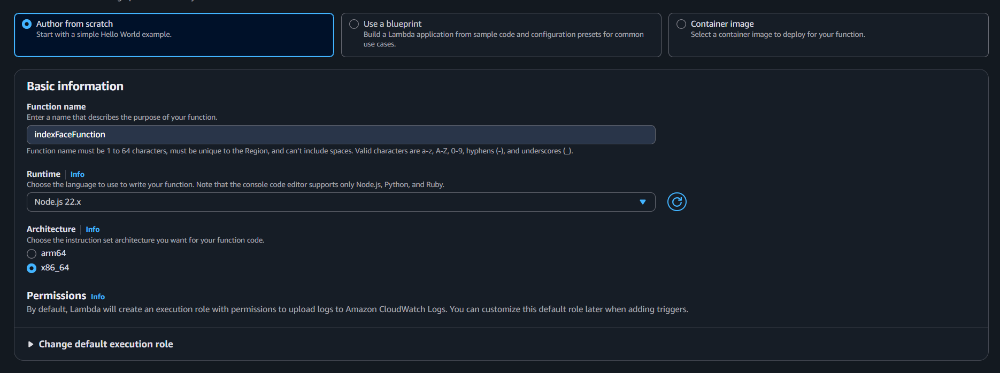
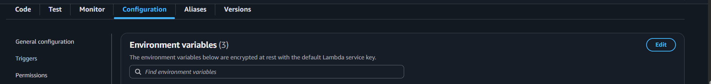
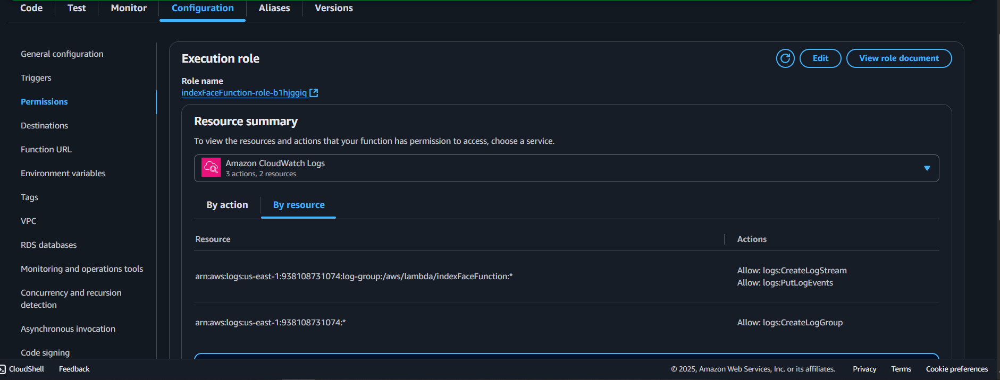

## Overview

This page shows steps to create the Lambda function **`indexFaceFunction`** used to upload images to S3 and index faces into an Amazon Rekognition collection.

---

## Step 1: Create the Lambda function

1. Sign in to the **AWS Management Console** and open the **Lambda** service.
2. Choose **Create function**.


3. Under **Author from scratch**:

   - **Function name:** `indexFaceFunction`
   - **Runtime:** `Node.js 22.x`
   - **Architecture:** `x86_64`

   Other `Additional configurations` can be left alone.



4. Choose **Create function**.


---

## Step 2: Add the function code

1. In the **Code** tab, replace the default code with the handler from the project folder:


Or copy this snippet for convinience from Amplify/functions/indexFaceFunction/handler.js

```javascript
import {
  IndexFacesCommand,
  RekognitionClient,
} from "@aws-sdk/client-rekognition";
import { PutObjectCommand, S3Client } from "@aws-sdk/client-s3";

const clientConfig = {
  region: process.env.AWS_REGION || "us-east-1",
  credentials: {
    accessKeyId: process.env.AWS_ACCESS_KEY_ID,
    secretAccessKey: process.env.AWS_SECRET_ACCESS_KEY,
  },
};

const s3Client = new S3Client(clientConfig);
const rekognitionClient = new RekognitionClient(clientConfig);

class RekognitionService {
  static async indexFaces(collectionId, bucket, s3Key, externalImageId) {
    const command = new IndexFacesCommand({
      CollectionId: collectionId,
      Image: {
        S3Object: {
          Bucket: bucket,
          Name: s3Key,
        },
      },
      DetectionAttributes: ["DEFAULT"],
      ExternalImageId: externalImageId,
    });

    return await rekognitionClient.send(command);
  }
}

class S3Service {
  static async uploadObject(bucket, key, body, contentType) {
    const command = new PutObjectCommand({
      Bucket: bucket,
      Key: key,
      Body: body,
      ContentType: contentType,
    });

    return await s3Client.send(command);
  }
}

export const handler = async (event) => {
  try {
    const { name, fileBase64, fileName, fileType } = JSON.parse(event.body);

    if (!name || !fileBase64 || !fileName || !fileType) {
      return {
        statusCode: 400,
        body: JSON.stringify({
          success: false,
          error: "Missing required fields",
        }),
      };
    }

    const safeName = `${Date.now()}_${name.replace(/[^a-zA-Z0-9_.\-:]/g, "_")}`;
    const s3Key = `faces/${safeName}.jpg`;

    const buffer = Buffer.from(fileBase64, "base64");

    // Upload to S3
    await S3Service.uploadObject(
      process.env.S3_BUCKET,
      s3Key,
      buffer,
      fileType
    );

    // Index face in Rekognition
    const rekogResult = await RekognitionService.indexFaces(
      process.env.REKOGNITION_COLLECTION,
      process.env.S3_BUCKET,
      s3Key,
      safeName
    );

    const faceRecord = rekogResult.FaceRecords?.[0];
    if (!faceRecord) {
      return {
        statusCode: 200,
        body: JSON.stringify({
          success: false,
          message: "No face detected in image",
        }),
      };
    }

    return {
      statusCode: 200,
      body: JSON.stringify({ success: true, name }),
    };
  } catch (err) {
    console.error("Error during face indexing:", err);
    return {
      statusCode: 500,
      body: JSON.stringify({ success: false, error: err.message }),
    };
  }
};
```

Choose Deploy (or Ctrl+Shift+U) to save your changes.

Step 3: Configure environment variables
In the Configuration tab, choose Environment variables.



Add the following:

```ini
S3_BUCKET=YOUR_S3_BUCKET_NAME
REKOGNITION_COLLECTION=YOUR_REKOGNITION_COLLECTION_NAME
DYNAMO_TABLE=YOUR_DYNAMO_TABLE_NAME
```


Save the changes.

Step 4: Assign IAM permissions
Your Lambda function needs access to Rekognition, S3, and DynamoDB.

Still in Configuration tab, go to Permission and click the link to the Role name attached to the Lambda function
Attach a policy with the following permissions:



This will guide you to the IAM Console, then you press "Add permission"


And "Create inline policy"


Next, paste this into the JSON format:

```bash
{
  "Version": "2012-10-17",
  "Statement": [
    { "Effect": "Allow", "Action": "rekognition:IndexFaces", "Resource": "*" },
    { "Effect": "Allow", "Action": ["s3:PutObject","s3:GetObject","s3:GetObjectAcl","s3:PutObjectAcl"], "Resource": "arn:aws:s3:::YOUR_S3_BUCKET_NAME/*" }
  ]
}
```

{}
Make sure to replace your YOUR_S3_BUCKET_NAME arn in the "Resource": "arn:aws:s3:::YOUR_S3_BUCKET_NAME/\*" to your actual S3 bucket.
{}

At this point, your Lambda function is ready to be integrated into the workflow for face indexing.
