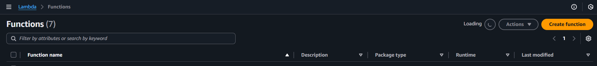
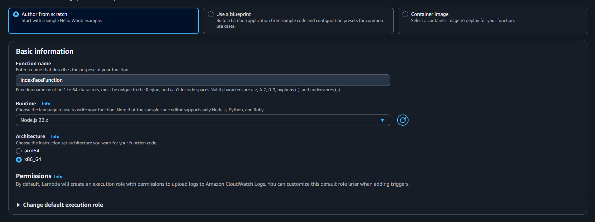
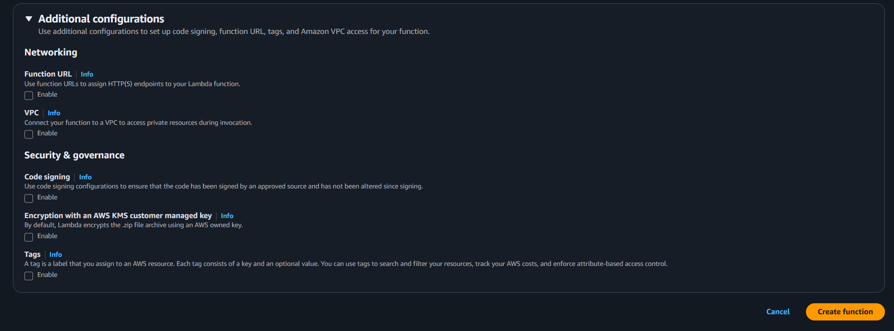
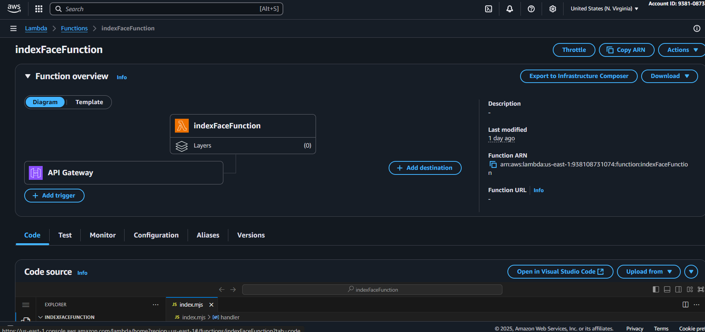
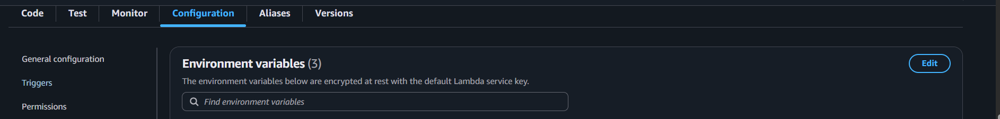
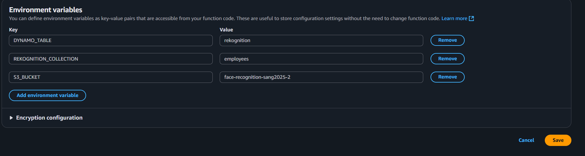
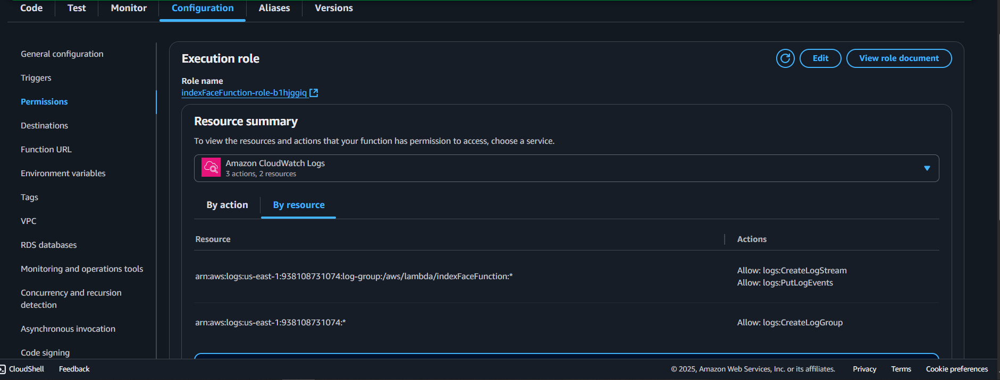
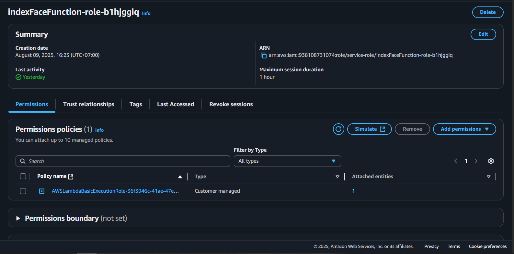
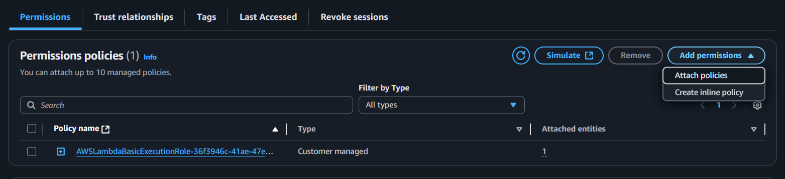

## Tổng quan

Trang này hướng dẫn các bước tạo hàm Lambda **`indexFaceFunction`** dùng để tải hình ảnh lên S3 và lập chỉ mục khuôn mặt vào bộ sưu tập Amazon Rekognition.

---

## Bước 1: Tạo hàm Lambda

1. Đăng nhập vào **AWS Management Console** và mở dịch vụ **Lambda**.
2. Chọn **Create function**.



3. Trong phần **Author from scratch**:

   - **Function name:** `indexFaceFunction`
   - **Runtime:** `Node.js 22.x`
   - **Architecture:** `x86_64`

   Các tùy chọn `Additional configurations` khác có thể để mặc định.



4. Chọn **Create function**.



---

## Bước 2: Thêm mã nguồn cho hàm

1. Trong tab **Code**, thay thế mã mặc định bằng mã `handler` từ thư mục dự án:



Hoặc sao chép đoạn mã này từ Amplify/functions/indexFaceFunction/handler.js để tiện sử dụng

```javascript
import {
  IndexFacesCommand,
  RekognitionClient,
} from "@aws-sdk/client-rekognition";
import { PutObjectCommand, S3Client } from "@aws-sdk/client-s3";

const clientConfig = {
  region: process.env.AWS_REGION || "us-east-1",
  credentials: {
    accessKeyId: process.env.AWS_ACCESS_KEY_ID,
    secretAccessKey: process.env.AWS_SECRET_ACCESS_KEY,
  },
};

const s3Client = new S3Client(clientConfig);
const rekognitionClient = new RekognitionClient(clientConfig);

class RekognitionService {
  static async indexFaces(collectionId, bucket, s3Key, externalImageId) {
    const command = new IndexFacesCommand({
      CollectionId: collectionId,
      Image: {
        S3Object: {
          Bucket: bucket,
          Name: s3Key,
        },
      },
      DetectionAttributes: ["DEFAULT"],
      ExternalImageId: externalImageId,
    });

    return await rekognitionClient.send(command);
  }
}

class S3Service {
  static async uploadObject(bucket, key, body, contentType) {
    const command = new PutObjectCommand({
      Bucket: bucket,
      Key: key,
      Body: body,
      ContentType: contentType,
    });

    return await s3Client.send(command);
  }
}

export const handler = async (event) => {
  try {
    const { name, fileBase64, fileName, fileType } = JSON.parse(event.body);

    if (!name || !fileBase64 || !fileName || !fileType) {
      return {
        statusCode: 400,
        body: JSON.stringify({
          success: false,
          error: "Missing required fields",
        }),
      };
    }

    const safeName = `${Date.now()}_${name.replace(/[^a-zA-Z0-9_.\-:]/g, "_")}`;
    const s3Key = `faces/${safeName}.jpg`;

    const buffer = Buffer.from(fileBase64, "base64");

    // Upload to S3
    await S3Service.uploadObject(
      process.env.S3_BUCKET,
      s3Key,
      buffer,
      fileType
    );

    // Index face in Rekognition
    const rekogResult = await RekognitionService.indexFaces(
      process.env.REKOGNITION_COLLECTION,
      process.env.S3_BUCKET,
      s3Key,
      safeName
    );

    const faceRecord = rekogResult.FaceRecords?.[0];
    if (!faceRecord) {
      return {
        statusCode: 200,
        body: JSON.stringify({
          success: false,
          message: "No face detected in image",
        }),
      };
    }

    return {
      statusCode: 200,
      body: JSON.stringify({ success: true, name }),
    };
  } catch (err) {
    console.error("Error during face indexing:", err);
    return {
      statusCode: 500,
      body: JSON.stringify({ success: false, error: err.message }),
    };
  }
};
```

Chọn Deploy (hoặc Ctrl+Shift+U) để lưu thay đổi.

---

## Bước 3: Cấu hình biến môi trường

Trong tab **Configuration**, chọn **Environment variables**.



Thêm các biến sau:

```ini
S3_BUCKET=YOUR_S3_BUCKET_NAME
REKOGNITION_COLLECTION=YOUR_REKOGNITION_COLLECTION_NAME
DYNAMO_TABLE=YOUR_DYNAMO_TABLE_NAME
```


Lưu thay đổi.

---

## Bước 4: Gán quyền IAM

Hàm Lambda của bạn cần quyền truy cập Rekognition, S3 và DynamoDB.

Vẫn ở tab **Configuration**, đi tới **Permission** và bấm vào liên kết **Role name** gắn với hàm Lambda.

Gắn một policy với các quyền sau:



Điều này sẽ đưa bạn đến IAM Console, sau đó nhấn "Add permission"



Và chọn "Create inline policy"



Tiếp theo, dán nội dung sau vào định dạng JSON:

```bash
{
  "Version": "2012-10-17",
  "Statement": [
    { "Effect": "Allow", "Action": "rekognition:IndexFaces", "Resource": "*" },
    { "Effect": "Allow", "Action": ["s3:PutObject","s3:GetObject","s3:GetObjectAcl","s3:PutObjectAcl"], "Resource": "arn:aws:s3:::YOUR_S3_BUCKET_NAME/*" }
  ]
}
```

{}
Hãy chắc chắn thay thế `YOUR_S3_BUCKET_NAME` trong `"Resource": "arn:aws:s3:::YOUR_S3_BUCKET_NAME/*"` bằng tên S3 bucket thực tế của bạn.
{}

Tại thời điểm này, hàm Lambda của bạn đã sẵn sàng được tích hợp vào quy trình lập chỉ mục khuôn mặt.
