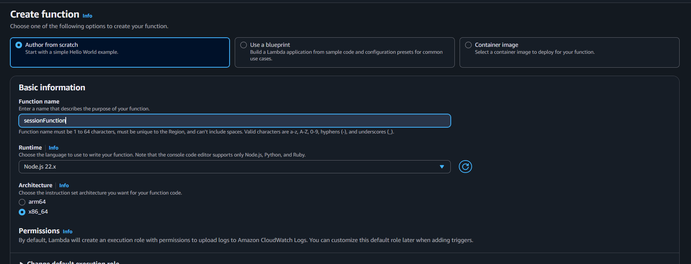
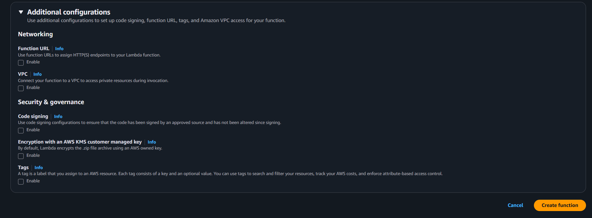
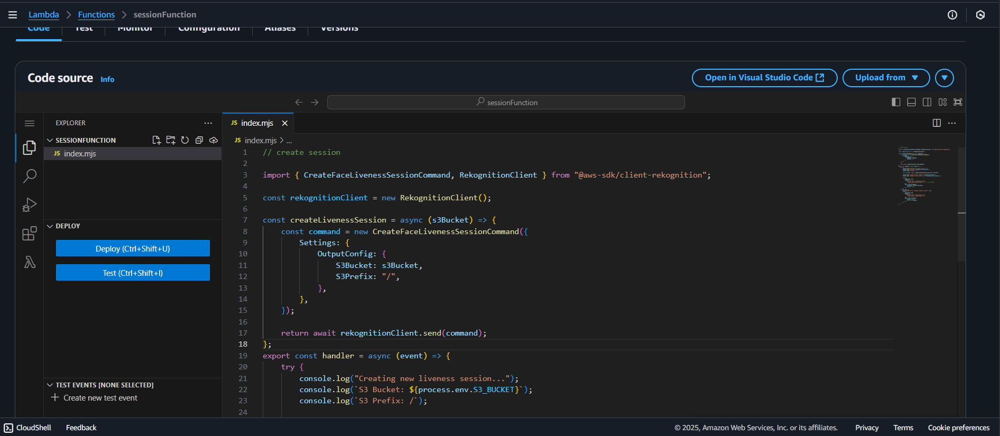
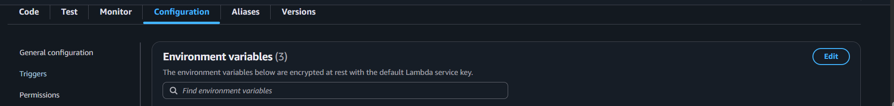
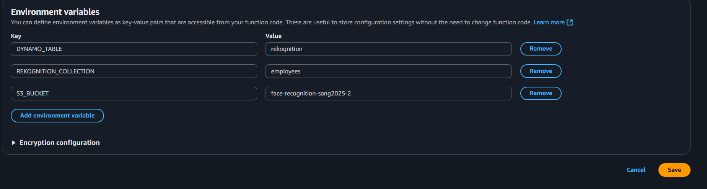
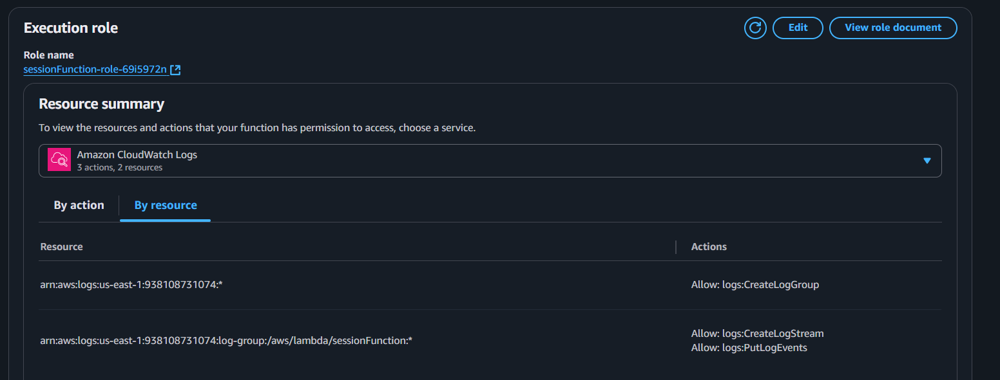
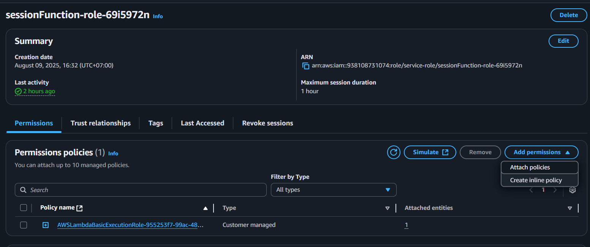

## Overview

This page describes how to create the **`sessionFunction`** Lambda function.  
It is used to start a new **Amazon Rekognition Face Liveness Session** and store relevant data in Amazon S3/DynamoDB.

---

## Step 1: Create the Lambda function

1. Still in Lambda console, navigate to functions.

2. Choose **Create function**.

3. Under **Author from scratch**:

   - **Function name:** `sessionFunction`
   - **Runtime:** `Node.js 22.x`
   - **Architecture:** `x86_64`

Other Additional configurations can be left alone.



4. Choose **Create function**.



---

## Step 2: Add the function code

1. In the **Code** tab, replace the default code with the handler from your Amplify project:



Or copy the `handler.js` file from:  
`Amplify/functions/sessionFunction/handler.js`

```javascript
// create session

import {
  CreateFaceLivenessSessionCommand,
  RekognitionClient,
} from "@aws-sdk/client-rekognition";

const clientConfig = {
  region: process.env.AWS_REGION || "us-east-1",
  credentials: {
    accessKeyId: process.env.AWS_ACCESS_KEY_ID,
    secretAccessKey: process.env.AWS_SECRET_ACCESS_KEY,
  },
};

const rekognitionClient = new RekognitionClient(clientConfig);

const createLivenessSession = async (s3Bucket) => {
  const command = new CreateFaceLivenessSessionCommand({
    Settings: {
      OutputConfig: {
        S3Bucket: s3Bucket,
        S3Prefix: "/",
      },
    },
  });

  return await rekognitionClient.send(command);
};
export const handler = async (event) => {
  try {
    console.log("Creating new liveness session...");
    console.log(`S3 Bucket: ${process.env.S3_BUCKET}`);
    console.log(`S3 Prefix: /`);

    const response = await createLivenessSession(process.env.S3_BUCKET);

    console.log(`Liveness session created: ${response.SessionId}`);
    console.log(`Output will be stored in: s3://${process.env.S3_BUCKET}/`);

    return {
      statusCode: 200,
      headers: {
        "Content-Type": "application/json",
        "Access-Control-Allow-Origin": "*", // nếu cần CORS
      },
      body: JSON.stringify({
        sessionId: response.SessionId,
        success: true,
      }),
    };
  } catch (err) {
    console.error("Error creating liveness session:", err);
    return {
      statusCode: 500,
      headers: {
        "Content-Type": "application/json",
        "Access-Control-Allow-Origin": "*",
      },
      body: JSON.stringify({
        success: false,
        error: err.message,
      }),
    };
  }
};
```

Choose **Deploy** (or `Ctrl + Shift + U`) to save your changes.

---

## Step 3: Configure environment variables

1. In the **Configuration** tab, choose **Environment variables**.



2. Add the following:

```ini
S3_BUCKET=YOUR_S3_BUCKET_NAME
REKOGNITION_COLLECTION=YOUR_REKOGNITION_COLLECTION_NAME
DYNAMO_TABLE=YOUR_DYNAMO_TABLE_NAME
```



3. Save changes.

---

## Step 4: Assign IAM permissions

Your Lambda function needs permission to create a Face Liveness Session and put objects in S3.

1. Still in the **Configuration** tab, go to **Permissions** and click the role name attached to your Lambda function.



2. This will open the IAM console — choose **Add permissions** → **Create inline policy**.



3. Switch to **JSON** view and paste:

```json
{
  "Version": "2012-10-17",
  "Statement": [
    {
      "Effect": "Allow",
      "Action": "rekognition:CreateFaceLivenessSession",
      "Resource": "*"
    },
    {
      "Effect": "Allow",
      "Action": ["s3:PutObject", "s3:PutObjectAcl"],
      "Resource": "arn:aws:s3:::YOUR_S3_BUCKET_NAME/*"
    }
  ]
}
```

{}
Replace `YOUR_S3_BUCKET_NAME` with your actual bucket name.
The `arn:aws:s3:::` format should exactly match your bucket.
{}

4. Save the policy and attach it to your Lambda execution role.

---

At this point, **`sessionFunction`** is ready to integrate with your workflow for creating Face Liveness Sessions in Rekognition.
