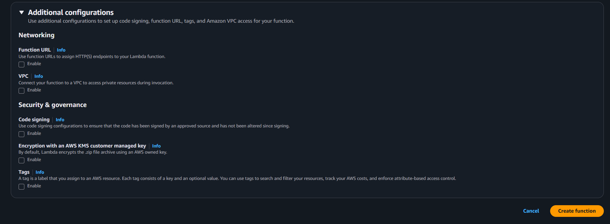
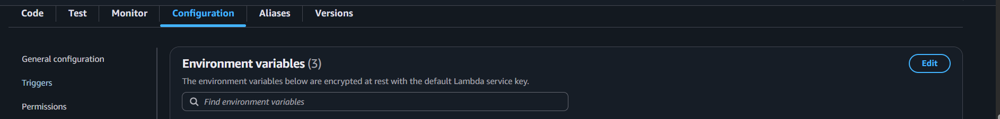
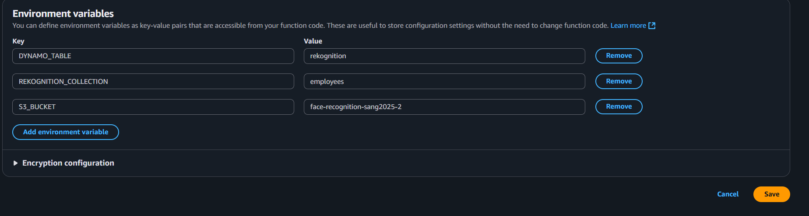
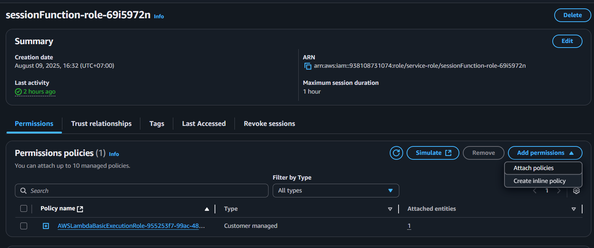

## Tổng quan

Trang này mô tả cách tạo hàm Lambda **`sessionFunction`**.  
Hàm này được sử dụng để khởi tạo **Phiên kiểm tra sống khuôn mặt (Face Liveness Session)** của Amazon Rekognition và lưu trữ dữ liệu liên quan vào Amazon S3/DynamoDB.

---

## Bước 1: Tạo hàm Lambda

1. Vẫn trong giao diện Lambda console, điều hướng đến **functions**.

2. Chọn **Create function**.

3. Trong phần **Author from scratch**:

   - **Function name:** `sessionFunction`
   - **Runtime:** `Node.js 22.x`
   - **Architecture:** `x86_64`

Các cấu hình bổ sung khác có thể để mặc định.


4. Chọn **Create function**.



---

## Bước 2: Thêm mã nguồn cho hàm

1. Trong tab **Code**, thay thế mã mặc định bằng mã `handler` từ dự án Amplify của bạn:


Hoặc sao chép tệp `handler.js` từ:  
`Amplify/functions/sessionFunction/handler.js`

```javascript
// create session

import {
  CreateFaceLivenessSessionCommand,
  RekognitionClient,
} from "@aws-sdk/client-rekognition";

const clientConfig = {
  region: process.env.AWS_REGION || "us-east-1",
  credentials: {
    accessKeyId: process.env.AWS_ACCESS_KEY_ID,
    secretAccessKey: process.env.AWS_SECRET_ACCESS_KEY,
  },
};

const rekognitionClient = new RekognitionClient(clientConfig);

const createLivenessSession = async (s3Bucket) => {
  const command = new CreateFaceLivenessSessionCommand({
    Settings: {
      OutputConfig: {
        S3Bucket: s3Bucket,
        S3Prefix: "/",
      },
    },
  });

  return await rekognitionClient.send(command);
};
export const handler = async (event) => {
  try {
    console.log("Creating new liveness session...");
    console.log(`S3 Bucket: ${process.env.S3_BUCKET}`);
    console.log(`S3 Prefix: /`);

    const response = await createLivenessSession(process.env.S3_BUCKET);

    console.log(`Liveness session created: ${response.SessionId}`);
    console.log(`Output will be stored in: s3://${process.env.S3_BUCKET}/`);

    return {
      statusCode: 200,
      headers: {
        "Content-Type": "application/json",
        "Access-Control-Allow-Origin": "*", // nếu cần CORS
      },
      body: JSON.stringify({
        sessionId: response.SessionId,
        success: true,
      }),
    };
  } catch (err) {
    console.error("Error creating liveness session:", err);
    return {
      statusCode: 500,
      headers: {
        "Content-Type": "application/json",
        "Access-Control-Allow-Origin": "*",
      },
      body: JSON.stringify({
        success: false,
        error: err.message,
      }),
    };
  }
};
```

Chọn **Deploy** (hoặc `Ctrl + Shift + U`) để lưu thay đổi.

---

## Bước 3: Cấu hình biến môi trường

1. Trong tab **Configuration**, chọn **Environment variables**.



2. Thêm các biến sau:

```ini
S3_BUCKET=YOUR_S3_BUCKET_NAME
REKOGNITION_COLLECTION=YOUR_REKOGNITION_COLLECTION_NAME
DYNAMO_TABLE=YOUR_DYNAMO_TABLE_NAME
```



3. Lưu thay đổi.

---

## Bước 4: Gán quyền IAM

Hàm Lambda của bạn cần quyền để tạo **Face Liveness Session** và ghi đối tượng vào S3.

1. Vẫn ở tab **Configuration**, chuyển tới **Permissions** và nhấp vào **role name** được gán cho hàm Lambda.


2. Thao tác này sẽ mở IAM console — chọn **Add permissions** → **Create inline policy**.



3. Chuyển sang chế độ **JSON** và dán vào:

```json
{
  "Version": "2012-10-17",
  "Statement": [
    {
      "Effect": "Allow",
      "Action": "rekognition:CreateFaceLivenessSession",
      "Resource": "*"
    },
    {
      "Effect": "Allow",
      "Action": ["s3:PutObject", "s3:PutObjectAcl"],
      "Resource": "arn:aws:s3:::YOUR_S3_BUCKET_NAME/*"
    }
  ]
}
```

{}
Hãy thay thế `YOUR_S3_BUCKET_NAME` bằng tên bucket thực tế của bạn.  
Định dạng `arn:aws:s3:::` phải khớp chính xác với bucket của bạn.
{}

4. Lưu policy và gán nó cho vai trò thực thi (execution role) của Lambda.

---

Tại thời điểm này, **`sessionFunction`** đã sẵn sàng tích hợp vào quy trình của bạn để tạo **Face Liveness Sessions** trong Rekognition.
