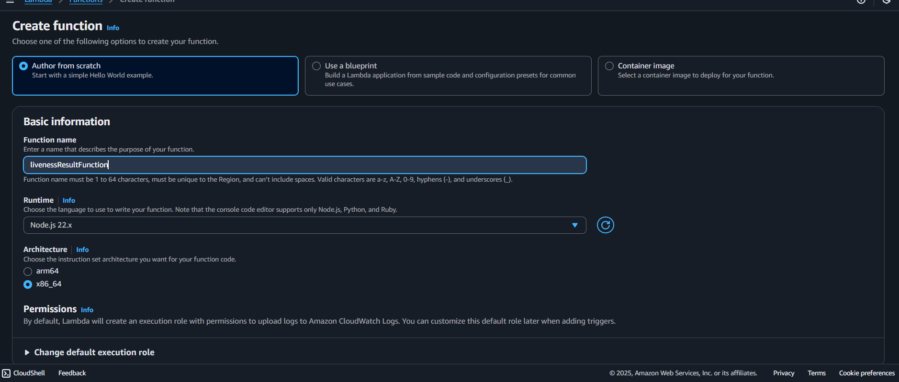
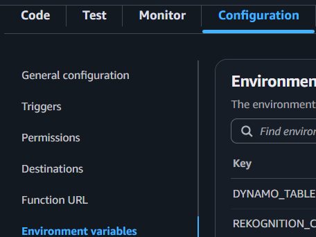
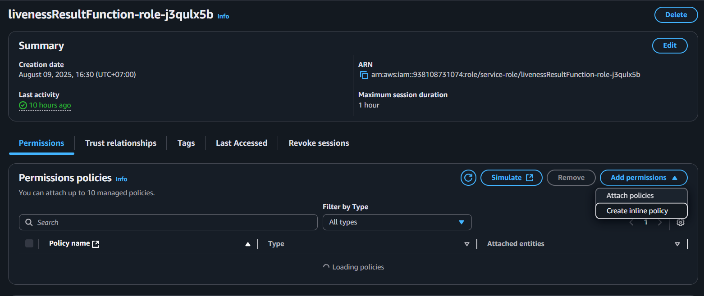

## Overview

This page describes how to create the **`livenessResultFunction`** Lambda function.  
It is used to retrieve the **Face Liveness Session results** from Amazon Rekognition, perform face matching, and store data in Amazon DynamoDB/S3.

---

## Step 1: Create the Lambda function

1. In the Lambda console, navigate to **Functions**.

2. Choose **Create function**.

3. Under **Author from scratch**:

   - **Function name:** `livenessResultFunction`
   - **Runtime:** `Node.js 22.x`
   - **Architecture:** `x86_64`

Other Additional configurations can be left alone.



4. Choose **Create function**.


---

## Step 2: Add the function code

1. In the **Code** tab, replace the default code with the handler from your Amplify project:


Or copy the `handler.js` file from:  
`Amplify/functions/livenessResultFunction/handler.js`

```javascript
// src/controllers/livenessController.js
import {
  GetFaceLivenessSessionResultsCommand,
  SearchFacesByImageCommand,
  DetectFacesCommand,
  CompareFacesCommand,
  RekognitionClient,
} from "@aws-sdk/client-rekognition";
import path from "path";
import { fileURLToPath } from "url";
import {
  GetObjectCommand,
  ListObjectsV2Command,
  S3Client,
} from "@aws-sdk/client-s3";
import { DynamoDBClient } from "@aws-sdk/client-dynamodb";
import { DynamoDBDocumentClient, PutCommand } from "@aws-sdk/lib-dynamodb";

// src/utils/constants.js
const CONSTANTS = {
  LIVENESS_CONFIDENCE_THRESHOLD: 85,
  FACE_MATCH_THRESHOLD: 70,
  MANUAL_CHECKIN_THRESHOLD: 90,
  PREVIEW_CLEANUP_DELAY: 5 * 60 * 1000, // 5 minutes
};

const checkedInUsers = new Set();
const __filename = fileURLToPath(import.meta.url);
const __dirname = path.dirname(__filename);

const clientConfig = {
  region: process.env.AWS_REGION || "us-east-1",
  credentials: {
    accessKeyId: process.env.AWS_ACCESS_KEY_ID,
    secretAccessKey: process.env.AWS_SECRET_ACCESS_KEY,
  },
};

const s3Client = new S3Client(clientConfig);
const rekognitionClient = new RekognitionClient(clientConfig);

const ddbDocClient = DynamoDBDocumentClient.from(
  new DynamoDBClient(clientConfig)
);

class ImageService {
  static logImageDetails(imageBuffer, sessionId, source = "unknown") {
    const sizeInKB = (imageBuffer.length / 1024).toFixed(2);
    const sizeInMB = (imageBuffer.length / (1024 * 1024)).toFixed(2);

    console.log("\n" + "=".repeat(60));
    console.log("  IMAGE CAPTURE LOG");
    console.log("=".repeat(60));
    console.log(` Session ID: ${sessionId}`);
    console.log(` Source: ${source}`);
    console.log(` Image Size: ${sizeInKB} KB (${sizeInMB} MB)`);
    console.log(` Buffer Length: ${imageBuffer.length} bytes`);
    console.log(` Timestamp: ${new Date().toISOString()}`);

    const isJPEG = imageBuffer[0] === 0xff && imageBuffer[1] === 0xd8;
    const isPNG = imageBuffer[0] === 0x89 && imageBuffer[1] === 0x50;

    console.log(
      `Format Valid: ${isJPEG ? "JPEG" : isPNG ? "PNG" : "Unknown/Invalid"}`
    );
    console.log(
      `First 10 bytes: [${Array.from(imageBuffer.slice(0, 10))
        .map((b) => b.toString(16).padStart(2, "0"))
        .join(", ")}]`
    );
    console.log("=".repeat(60) + "\n");

    return {
      sizeKB: parseFloat(sizeInKB),
      sizeMB: parseFloat(sizeInMB),
      isValid: isJPEG || isPNG,
      format: isJPEG ? "JPEG" : isPNG ? "PNG" : "Unknown",
    };
  }
}

class DynamoService {
  static async saveCheckin(externalImageId) {
    const now = new Date();
    const dateKey = now.toISOString().split("T")[0]; // YYYY-MM-DD
    const time = now.toTimeString().split(" ")[0]; // HH:mm:ss

    const command = new PutCommand({
      TableName: process.env.DYNAMO_TABLE,
      Item: {
        externalImageId, // Partition key
        checkinDay: dateKey, // Sort key
        checkinTime: time,
      },
    });

    await ddbDocClient.send(command);
  }
}

class RekognitionService {
  static async getLivenessSessionResults(sessionId) {
    const command = new GetFaceLivenessSessionResultsCommand({
      SessionId: sessionId,
    });

    return await rekognitionClient.send(command);
  }

  static async detectFaces(imageBuffer) {
    const command = new DetectFacesCommand({
      Image: { Bytes: imageBuffer },
    });

    return await rekognitionClient.send(command);
  }

  static async compareFaces(
    sourceImage,
    targetImage,
    threshold = CONSTANTS.FACE_MATCH_THRESHOLD
  ) {
    const command = new CompareFacesCommand({
      SourceImage: { Bytes: sourceImage },
      TargetImage: { Bytes: targetImage },
      SimilarityThreshold: threshold,
    });

    return await rekognitionClient.send(command);
  }

  static async searchFacesByImage(
    collectionId,
    imageBuffer,
    threshold = CONSTANTS.FACE_MATCH_THRESHOLD,
    maxFaces = 5
  ) {
    const command = new SearchFacesByImageCommand({
      CollectionId: collectionId,
      Image: { Bytes: imageBuffer },
      FaceMatchThreshold: threshold,
      MaxFaces: maxFaces,
    });

    return await rekognitionClient.send(command);
  }
}

class S3Service {
  static async getObject(bucket, key) {
    try {
      console.log(`Fetching S3 object: s3://${bucket}/${key}`);

      const command = new GetObjectCommand({ Bucket: bucket, Key: key });
      const result = await s3Client.send(command);

      console.log(`S3 fetch successful:`);
      console.log(`Content-Type: ${result.ContentType}`);
      console.log(`Content-Length: ${result.ContentLength} bytes`);
      console.log(`Last-Modified: ${result.LastModified}`);

      const streamToBuffer = async (stream) => {
        const chunks = [];
        for await (const chunk of stream) {
          chunks.push(chunk);
        }
        return Buffer.concat(chunks);
      };

      return await streamToBuffer(result.Body);
    } catch (error) {
      console.error(`Error getting S3 object ${key}:`, error.message);
      throw error;
    }
  }

  static async listObjects(bucket, prefix) {
    try {
      console.log(`Listing S3 objects with prefix: s3://${bucket}/${prefix}`);
      let allObjects = [];
      const prefixes = [prefix, "/", "faces/"]; // Include possible prefixes

      for (const p of prefixes) {
        const params = { Bucket: bucket, Prefix: p, MaxKeys: 100 };
        const result = await s3Client.send(new ListObjectsV2Command(params));
        allObjects = allObjects.concat(result.Contents || []);
        console.log(
          `Found ${result.Contents?.length || 0} objects for prefix ${p}:`
        );
        console.log("Objects:", JSON.stringify(result.Contents || [], null, 2));
      }

      // Log all bucket contents
      const fullList = await s3Client.send(
        new ListObjectsV2Command({ Bucket: bucket })
      );
      console.log(
        "All bucket objects:",
        JSON.stringify(fullList.Contents || [], null, 2)
      );

      allObjects.forEach((obj, index) => {
        console.log(
          `   ${index + 1}. ${obj.Key} (${obj.Size} bytes, ${obj.LastModified})`
        );
      });

      return allObjects;
    } catch (error) {
      console.error(
        `Error listing S3 objects with prefix ${prefix}:`,
        error.message
      );
      throw error;
    }
  }
}

class LivenessController {
  static async processFaceMatching(sessionId, preview, compareFaceId) {
    console.log("\nStep 2: Looking for reference image in S3...");

    let faceMatch = { found: false };
    let capturedImageInfo = null;
    let previewUrl = null;

    try {
      const s3Prefix = `${sessionId}/`;
      const s3Objects = await S3Service.listObjects(
        process.env.S3_BUCKET,
        s3Prefix
      );

      const referenceImageObj = s3Objects.find((obj) => {
        const key = obj.Key.toLowerCase();
        return (
          key.includes("reference") ||
          key.includes("image") ||
          key.includes("face") ||
          key.includes("frame") ||
          key.endsWith(".jpg") ||
          key.endsWith(".jpeg") ||
          key.endsWith(".png")
        );
      });

      if (referenceImageObj) {
        console.log(`✅ Found reference image: ${referenceImageObj.Key}`);

        const imageBuffer = await S3Service.getObject(
          process.env.S3_BUCKET,
          referenceImageObj.Key
        );

        capturedImageInfo = ImageService.logImageDetails(
          imageBuffer,
          sessionId,
          "AWS Liveness Session"
        );

        console.log("\nStep 3: Searching for face match in collection...");

        const detectFaces = await RekognitionService.detectFaces(imageBuffer);
        console.log(
          "DetectFaces response:",
          JSON.stringify(detectFaces, null, 2)
        );

        if (!detectFaces.FaceDetails || detectFaces.FaceDetails.length === 0) {
          console.log("❌ No faces detected in the image");
          faceMatch = { found: false, error: "No faces detected in the image" };
        } else {
          faceMatch = await LivenessController.performFaceMatching(
            imageBuffer,
            compareFaceId
          );
        }
      } else {
        console.log("❌ No reference image found in S3");
      }
    } catch (error) {
      console.error("❌ Face matching error:", error);
      faceMatch = {
        found: false,
        error: error.message,
      };
    }

    return {
      faceMatch,
      capturedImage: {
        found: !!capturedImageInfo,
        details: capturedImageInfo,
        previewUrl: previewUrl,
      },
    };
  }

  static async performFaceMatching(imageBuffer, compareFaceId) {
    if (compareFaceId) {
      console.log(`🔍 Comparing with specific face ID: ${compareFaceId}`);

      try {
        const referenceImageBuffer = await S3Service.getObject(
          process.env.S3_BUCKET,
          `faces/${compareFaceId}.jpg`
        );

        const compareResult = await RekognitionService.compareFaces(
          imageBuffer,
          referenceImageBuffer
        );

        console.log(
          "CompareFaces response:",
          JSON.stringify(compareResult, null, 2)
        );

        if (compareResult.FaceMatches && compareResult.FaceMatches.length > 0) {
          const bestMatch = compareResult.FaceMatches[0];
          console.log(
            `🎉 Face match with ${compareFaceId}: ${bestMatch.Similarity.toFixed(
              1
            )}%`
          );

          return {
            found: true,
            name: compareFaceId,
            similarity: bestMatch.Similarity,
            details: bestMatch,
          };
        } else {
          console.log(`❌ No match found for face ID: ${compareFaceId}`);
          return { found: false };
        }
      } catch (error) {
        console.error(
          `❌ Error comparing with face ID ${compareFaceId}:`,
          error
        );
        return { found: false, error: error.message };
      }
    } else {
      // Use SearchFacesByImage (existing logic)
      const searchResult = await RekognitionService.searchFacesByImage(
        process.env.REKOGNITION_COLLECTION,
        imageBuffer
      );

      console.log(
        `🔍 Face search results: ${
          searchResult.FaceMatches?.length || 0
        } matches found`
      );
      console.log(
        "Raw searchFacesByImage response:",
        JSON.stringify(searchResult, null, 2)
      );

      if (searchResult.FaceMatches && searchResult.FaceMatches.length > 0) {
        searchResult.FaceMatches.forEach((match, index) => {
          console.log(`   Match ${index + 1}:`);
          console.log(`     Name: ${match.Face.ExternalImageId}`);
          console.log(`     Similarity: ${match.Similarity.toFixed(2)}%`);
          console.log(`     Face ID: ${match.Face.FaceId}`);
        });

        const bestMatch = searchResult.FaceMatches[0];
        const name = bestMatch.Face.ExternalImageId;
        const similarity = bestMatch.Similarity;

        checkedInUsers.add(name);

        console.log(
          `🎉 Best face match: ${name} with ${similarity.toFixed(
            1
          )}% similarity`
        );

        return {
          found: true,
          name: name,
          similarity: similarity,
          faceId: bestMatch.Face.FaceId,
          allMatches: searchResult.FaceMatches.map((match) => ({
            name: match.Face.ExternalImageId,
            similarity: match.Similarity,
            faceId: match.Face.FaceId,
          })),
        };
      } else {
        console.log("❌ No face matches found in collection");
        return { found: false };
      }
    }
  }
}

export const handler = async (event) => {
  const sessionId = event.pathParameters?.sessionId;
  const { preview = "false", compareFaceId = null } =
    event.queryStringParameters || {};

  console.log("\n" + "=".repeat(20));
  console.log(`Processing liveness result for session: ${sessionId}`);
  console.log(`Preview requested: ${preview === "true" ? "YES" : "NO"}`);
  console.log(`Compare Face ID: ${compareFaceId || "None"}`);
  console.log("=".repeat(20) + "\n");

  if (!sessionId) {
    return {
      statusCode: 400,
      headers: { "Content-Type": "application/json" },
      body: JSON.stringify({
        success: false,
        error: "Missing session ID",
      }),
    };
  }

  try {
    // Step 1: Get liveness results
    console.log("Step 1: Calling AWS Rekognition for liveness results...");
    const livenessResult = await RekognitionService.getLivenessSessionResults(
      sessionId
    );

    console.log("Liveness Analysis Results:");
    console.log(`Status: ${livenessResult.Status}`);
    console.log(`Confidence: ${livenessResult.Confidence}%`);
    console.log(`Session ID: ${livenessResult.SessionId}`);

    const isLive =
      livenessResult.Status === "SUCCEEDED" &&
      livenessResult.Confidence > CONSTANTS.LIVENESS_CONFIDENCE_THRESHOLD;

    if (!isLive) {
      return {
        statusCode: 200,
        headers: { "Content-Type": "application/json" },
        body: JSON.stringify({
          success: true,
          isLive: false,
          confidence: livenessResult.Confidence / 100,
          reason:
            livenessResult.Status === "FAILED"
              ? "Liveness check failed"
              : `Low confidence score: ${livenessResult.Confidence}%`,
          message: "Liveness verification failed. Please try again.",
        }),
      };
    }

    console.log("✅ Liveness verification passed!");

    // Step 2: Process face matching
    const faceMatchResult = await LivenessController.processFaceMatching(
      sessionId,
      preview,
      compareFaceId
    );

    const response = {
      success: true,
      isLive: true,
      confidence: livenessResult.Confidence / 100,
      faceMatch: faceMatchResult.faceMatch,
      sessionId: sessionId,
      capturedImage: faceMatchResult.capturedImage,
      timestamp: new Date().toISOString(),
    };

    // Set appropriate message
    if (faceMatchResult.faceMatch.found) {
      response.message = `Welcome ${
        faceMatchResult.faceMatch.name
      }! Face verified with ${faceMatchResult.faceMatch.similarity.toFixed(
        1
      )}% similarity.`;
      try {
        await DynamoService.saveCheckin(faceMatchResult.faceMatch.name);
        console.log(`Check-in saved for ${faceMatchResult.faceMatch.name}`);
      } catch (error) {
        console.error("Failed to save check-in:", error);
        throw new Error(error);
      }
    } else if (faceMatchResult.faceMatch.error) {
      response.message =
        "Liveness verified but face matching encountered an error.";
    } else {
      response.message =
        "You are verified as a live person, but your face is not in our system.";
    }

    console.log("\n🎊 Final Response Summary:");
    console.log(`   Liveness: ${response.isLive ? "✅ PASS" : "❌ FAIL"}`);
    console.log(
      `   Face Match: ${
        faceMatchResult.faceMatch.found ? "✅ FOUND" : "❌ NOT FOUND"
      }`
    );
    console.log(
      `   Image Captured: ${response.capturedImage.found ? "YES" : "NO"}`
    );
    console.log("🎊".repeat(20) + "\n");

    return {
      statusCode: 200,
      headers: { "Content-Type": "application/json" },
      body: JSON.stringify(response),
    };
  } catch (error) {
    return {
      statusCode: 500,
      headers: { "Content-Type": "application/json" },
      body: JSON.stringify({
        success: false,
        error: error.message,
        message: "Failed to process liveness results. Please try again.",
        timestamp: new Date().toISOString(),
      }),
    };
  }
};
```

Choose **Deploy** (or `Ctrl + Shift + U`) to save your changes.

---

## Step 3: Configure environment variables

1. In the **Configuration** tab, choose **Environment variables**.



2. Add the following:

```ini
S3_BUCKET=YOUR_S3_BUCKET_NAME
REKOGNITION_COLLECTION=YOUR_REKOGNITION_COLLECTION_NAME
DYNAMO_TABLE=YOUR_DYNAMO_TABLE_NAME
```


3. Save changes.

---

## Step 4: Assign IAM permissions

Your Lambda function needs permission to fetch Liveness Session results, search faces, detect faces, compare faces, put data in DynamoDB, and interact with your S3 bucket.

1. In the **Configuration** tab, go to **Permissions** and click the role name attached to your Lambda function.


2. In IAM, choose **Add permissions** → **Create inline policy**.



3. Switch to **JSON** view and paste:

{}
Replace the S3 bucket ARN and DynamoDB/collection ARNs with your actual resource names if different. As well as your AWS Region, AWS Rekognition collection, do not paste this json only, read carefully!!!
{}

```json
{
  "Version": "2012-10-17",
  "Statement": [
    {
      "Effect": "Allow",
      "Action": "dynamodb:PutItem",
      "Resource": "arn:aws:dynamodb:AWS_REGION:UserId:table/DYNAMO_TABLE"
    },
    {
      "Effect": "Allow",
      "Action": ["rekognition:SearchFaces", "rekognition:SearchFacesByImage"],
      "Resource": "arn:aws:rekognition:us-east-1:UserId:collection/REKOGNITION_COLLECTION"
    },
    {
      "Effect": "Allow",
      "Action": [
        "rekognition:DetectFaces",
        "rekognition:CompareFaces",
        "rekognition:GetFaceLivenessSessionResults"
      ],
      "Resource": "*"
    },
    {
      "Effect": "Allow",
      "Action": [
        "s3:PutObject",
        "s3:GetObjectAcl",
        "s3:GetObject",
        "s3:ListBucket",
        "s3:PutObjectAcl"
      ],
      "Resource": [
        "arn:aws:s3:::S3_BUCKET_NAME",
        "arn:aws:s3:::S3_BUCKET_NAME/*"
      ]
    }
  ]
}
```

4. Save the policy and attach it to your Lambda execution role.

---

At this point, **`livenessResultFunction`** is ready to be integrated for retrieving liveness results, running face matching, and storing data.
