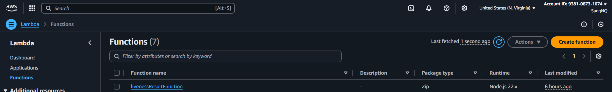
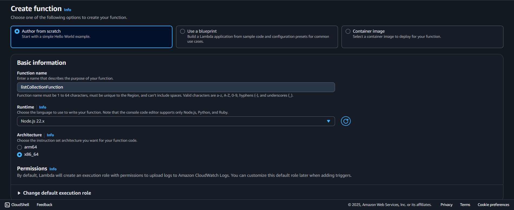
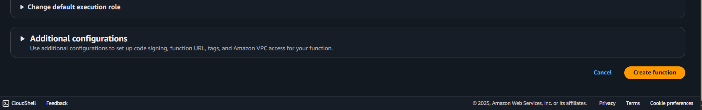
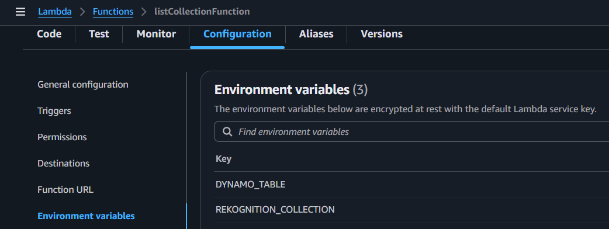
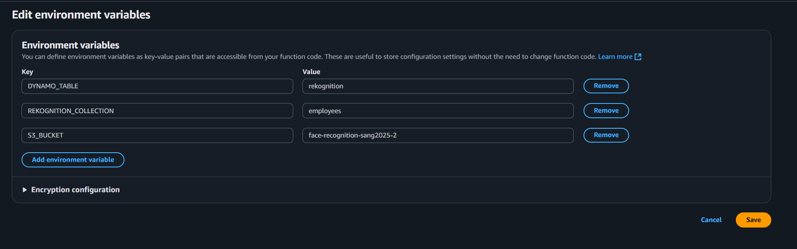
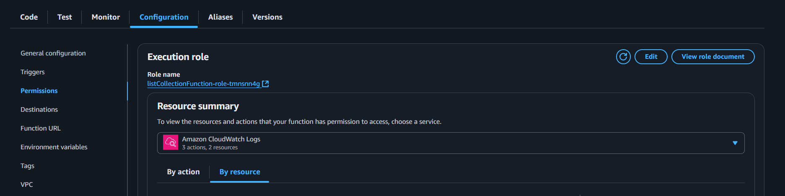
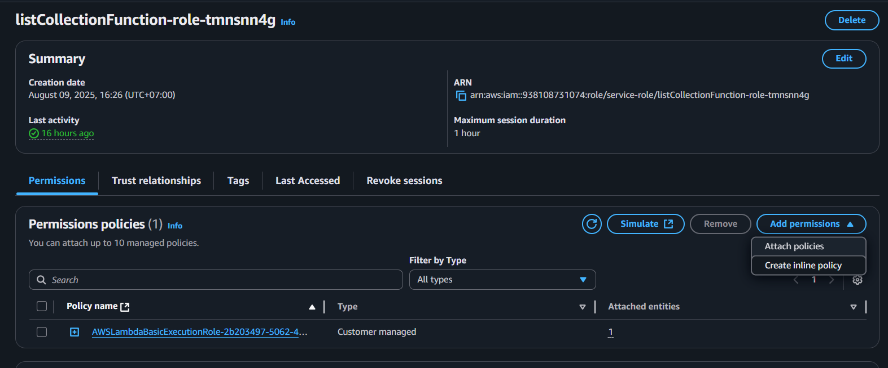
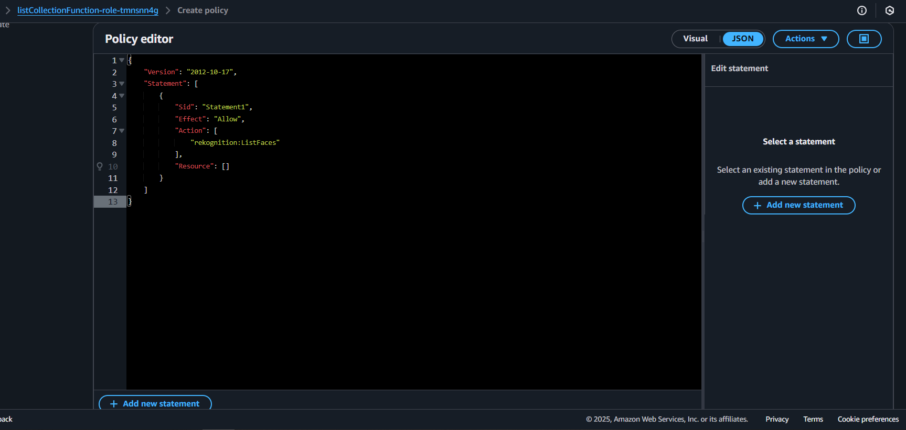

## Overview

This page describes how to create the **`listCollectionFunction`** Lambda function.  
It is used to retrieve the list of all faces currently stored in your Amazon Rekognition collection.

---

## Step 1: Create the Lambda function

1. In the Lambda console, navigate to **Functions**.



2. Choose **Create function**.

3. Under **Author from scratch**:

   - **Function name:** `listCollectionFunction`
   - **Runtime:** `Node.js 22.x`
   - **Architecture:** `x86_64`

Other Additional configurations can be left alone.



4. Choose **Create function**.



## Step 2: Add the function code

1. In the **Code** tab, replace the default code with the handler from your Amplify project:


Or copy the `handler.js` file from:  
`Amplify/functions/listCollectionFunction/handler.js`

```javascript
import {
  ListFacesCommand,
  RekognitionClient,
} from "@aws-sdk/client-rekognition";

const clientConfig = {
  region: process.env.AWS_REGION || "us-east-1",
  credentials: {
    accessKeyId: process.env.AWS_ACCESS_KEY_ID,
    secretAccessKey: process.env.AWS_SECRET_ACCESS_KEY,
  },
};

const rekognitionClient = new RekognitionClient(clientConfig);

class RekognitionService {
  static async listFaces(collectionId, maxResults = 100, nextToken = null) {
    const command = new ListFacesCommand({
      CollectionId: collectionId,
      MaxResults: maxResults,
      ...(nextToken && { NextToken: nextToken }),
    });

    return await rekognitionClient.send(command);
  }
}

export const handler = async (event) => {
  try {
    const faces = [];
    let result = await RekognitionService.listFaces(
      process.env.REKOGNITION_COLLECTION,
      100
    );

    faces.push(...result.Faces);

    while (result.NextToken) {
      result = await RekognitionService.listFaces(
        process.env.REKOGNITION_COLLECTION,
        100,
        result.NextToken
      );
      faces.push(...result.Faces);
    }

    console.log(faces);

    const processed = faces.map((face) => ({
      FaceId: face.FaceId,
      ExternalImageId: face.ExternalImageId,
      s3Key: `faces/${face.ExternalImageId}.jpg`,
    }));

    return {
      statusCode: 200,
      headers: {
        "Content-Type": "application/json",
        "Access-Control-Allow-Origin": "*", // nếu cần CORS
      },
      body: JSON.stringify({ success: true, faces: processed }),
    };
  } catch (err) {
    console.error("Error listing collections:", err);
    return {
      statusCode: 500,
      headers: {
        "Content-Type": "application/json",
        "Access-Control-Allow-Origin": "*",
      },
      body: JSON.stringify({ success: false, error: err.message }),
    };
  }
};
```

Choose **Deploy** (or `Ctrl + Shift + U`) to save your changes.

---

## Step 3: Configure environment variables

1. In the **Configuration** tab, choose **Environment variables**.



2. Add the following:

```ini
S3_BUCKET=YOUR_S3_BUCKET_NAME
REKOGNITION_COLLECTION=YOUR_REKOGNITION_COLLECTION_NAME
DYNAMO_TABLE=YOUR_DYNAMO_TABLE_NAME
```



3. Save changes.

---

## Step 4: Assign IAM permissions

Your Lambda function needs permission to list all faces from your Rekognition collection.

1. In the **Configuration** tab, go to **Permissions** and click the role name attached to your Lambda function.



2. In IAM, choose **Add permissions** → **Create inline policy**.



3. Switch to **JSON** view and paste:

```json
{
  "Version": "2012-10-17",
  "Statement": [
    {
      "Effect": "Allow",
      "Action": "rekognition:ListFaces",
      "Resource": "*"
    }
  ]
}
```



4. Save the policy and attach it to your Lambda execution role.

---

At this point, **`listCollectionFunction`** is ready to be used to query all faces in your Rekognition collection.
