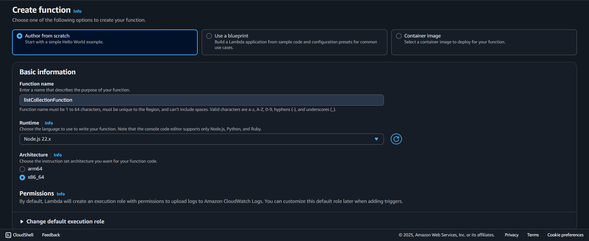
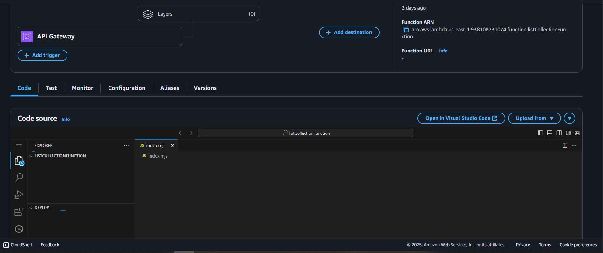
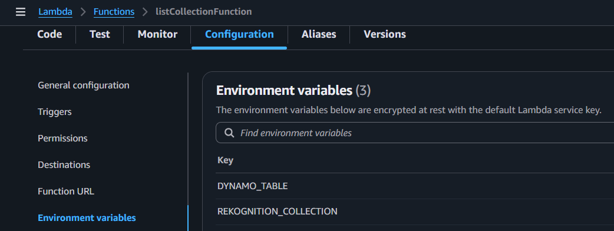
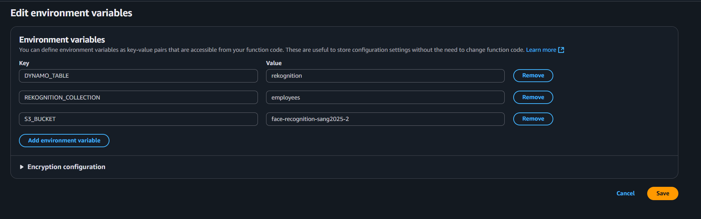
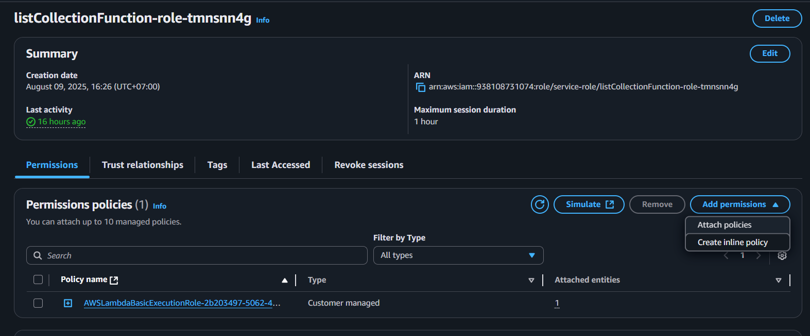
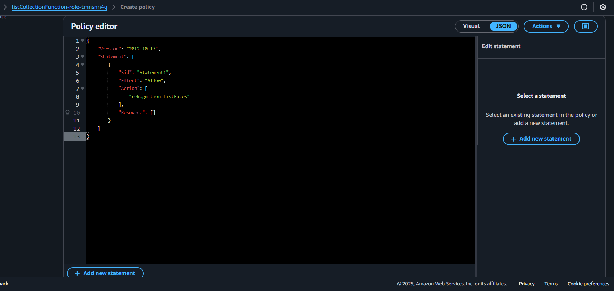

## Tổng quan

Trang này mô tả cách tạo hàm Lambda **`listCollectionFunction`**.  
Nó được sử dụng để truy xuất danh sách tất cả các khuôn mặt hiện đang được lưu trữ trong bộ sưu tập Amazon Rekognition của bạn.

---

## Bước 1: Tạo hàm Lambda

1. Trong bảng điều khiển Lambda, điều hướng đến **Functions**.


2. Chọn **Create function**.

3. Trong phần **Author from scratch**:

   - **Function name:** `listCollectionFunction`
   - **Runtime:** `Node.js 22.x`
   - **Architecture:** `x86_64`

Các cấu hình bổ sung khác có thể để mặc định.



4. Chọn **Create function**.


## Bước 2: Thêm mã hàm

1. Trong tab **Code**, thay thế mã mặc định bằng handler từ dự án Amplify của bạn:



Hoặc sao chép tệp `handler.js` từ:  
`Amplify/functions/listCollectionFunction/handler.js`

```javascript
import {
  ListFacesCommand,
  RekognitionClient,
} from "@aws-sdk/client-rekognition";

const clientConfig = {
  region: process.env.AWS_REGION || "us-east-1",
  credentials: {
    accessKeyId: process.env.AWS_ACCESS_KEY_ID,
    secretAccessKey: process.env.AWS_SECRET_ACCESS_KEY,
  },
};

const rekognitionClient = new RekognitionClient(clientConfig);

class RekognitionService {
  static async listFaces(collectionId, maxResults = 100, nextToken = null) {
    const command = new ListFacesCommand({
      CollectionId: collectionId,
      MaxResults: maxResults,
      ...(nextToken && { NextToken: nextToken }),
    });

    return await rekognitionClient.send(command);
  }
}

export const handler = async (event) => {
  try {
    const faces = [];
    let result = await RekognitionService.listFaces(
      process.env.REKOGNITION_COLLECTION,
      100
    );

    faces.push(...result.Faces);

    while (result.NextToken) {
      result = await RekognitionService.listFaces(
        process.env.REKOGNITION_COLLECTION,
        100,
        result.NextToken
      );
      faces.push(...result.Faces);
    }

    console.log(faces);

    const processed = faces.map((face) => ({
      FaceId: face.FaceId,
      ExternalImageId: face.ExternalImageId,
      s3Key: `faces/${face.ExternalImageId}.jpg`,
    }));

    return {
      statusCode: 200,
      headers: {
        "Content-Type": "application/json",
        "Access-Control-Allow-Origin": "*", // nếu cần CORS
      },
      body: JSON.stringify({ success: true, faces: processed }),
    };
  } catch (err) {
    console.error("Lỗi khi liệt kê bộ sưu tập:", err);
    return {
      statusCode: 500,
      headers: {
        "Content-Type": "application/json",
        "Access-Control-Allow-Origin": "*",
      },
      body: JSON.stringify({ success: false, error: err.message }),
    };
  }
};
```

Chọn **Deploy** (hoặc `Ctrl + Shift + U`) để lưu thay đổi của bạn.

---

## Bước 3: Cấu hình biến môi trường

1. Trong tab **Configuration**, chọn **Environment variables**.



2. Thêm các biến sau:

```ini
S3_BUCKET=TÊN_BUCKET_S3_CỦA_BẠN
REKOGNITION_COLLECTION=TÊN_BỘ_SƯU_TẬP_REKOGNITION_CỦA_BẠN
DYNAMO_TABLE=TÊN_BẢNG_DYNAMO_CỦA_BẠN
```



3. Lưu thay đổi.

---

## Bước 4: Gán quyền IAM

Hàm Lambda của bạn cần quyền để liệt kê tất cả các khuôn mặt từ bộ sưu tập Rekognition của bạn.

1. Trong tab **Configuration**, vào **Permissions** và nhấp vào tên vai trò được gán cho hàm Lambda của bạn.


2. Trong IAM, chọn **Add permissions** → **Create inline policy**.



3. Chuyển sang chế độ xem **JSON** và dán:

```json
{
  "Version": "2012-10-17",
  "Statement": [
    {
      "Effect": "Allow",
      "Action": "rekognition:ListFaces",
      "Resource": "*"
    }
  ]
}
```



4. Lưu chính sách và gán nó cho vai trò thực thi của Lambda.

---

Tại thời điểm này, **`listCollectionFunction`** đã sẵn sàng để được sử dụng để truy vấn tất cả các khuôn mặt trong bộ sưu tập Rekognition của bạn.
