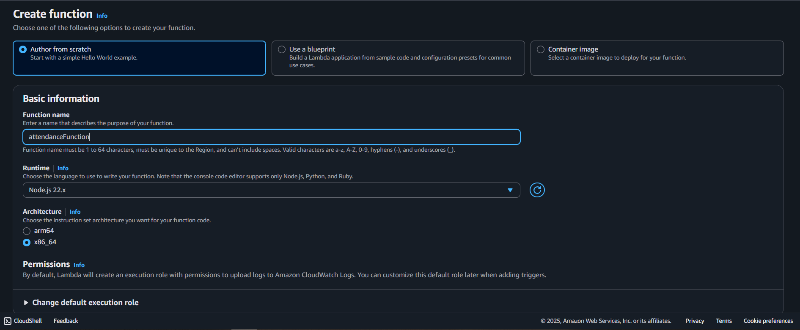
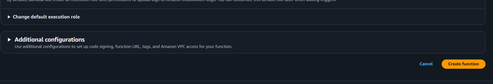
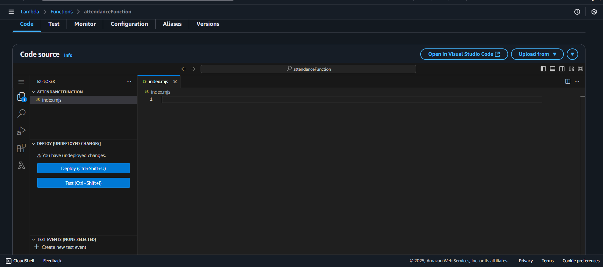
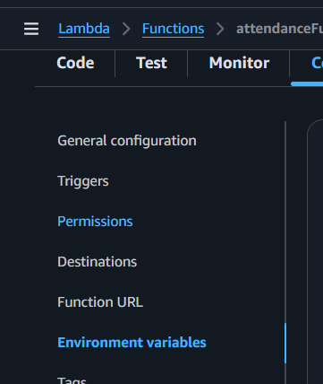
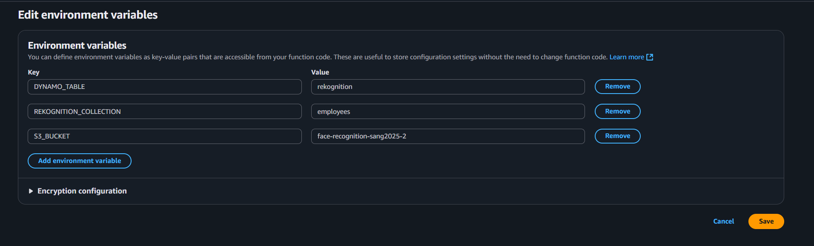

## Overview

This page describes how to create the **`attendanceFunction`** Lambda function.  
It is used to query attendance data from DynamoDB based on your Rekognition collection results.

---

## Step 1: Create the Lambda function

1. In the Lambda console, navigate to **Functions**.

2. Choose **Create function**.

3. Under **Author from scratch**:

   - **Function name:** `attendanceFunction`
   - **Runtime:** `Node.js 22.x`
   - **Architecture:** `x86_64`

Other Additional configurations can be left alone.



4. Choose **Create function**.



---

## Step 2: Add the function code

1. In the **Code** tab, replace the default code with the handler from your Amplify project:



Or copy the `handler.js` file from:  
`Amplify/functions/attendanceFunction/handler.js`

```javascript
import { DynamoDBClient } from "@aws-sdk/client-dynamodb";
import { DynamoDBDocumentClient, QueryCommand } from "@aws-sdk/lib-dynamodb";

const dynamoClient = new DynamoDBClient({ region: process.env.AWS_REGION });
const ddbDocClient = DynamoDBDocumentClient.from(dynamoClient);

export const handler = async (event) => {
  try {
    const { externalImageId } = event.queryStringParameters || {};

    if (!externalImageId) {
      return {
        statusCode: 400,
        body: JSON.stringify({
          success: false,
          error: "Missing externalImageId",
        }),
      };
    }

    const today = new Date().toISOString().split("T")[0];

    const params = {
      TableName: process.env.DYNAMO_TABLE,
      KeyConditionExpression: "externalImageId = :pk AND checkinDay = :today",
      ExpressionAttributeValues: {
        ":pk": externalImageId,
        ":today": today,
      },
    };

    const result = await ddbDocClient.send(new QueryCommand(params));

    const items = result.Items || [];

    return {
      statusCode: 200,
      body: JSON.stringify({
        success: true,
        count: items.length,
        items,
      }),
    };
  } catch (err) {
    console.error("Error fetching today's check-ins:", err);
    return {
      statusCode: 500,
      body: JSON.stringify({ success: false, error: err.message }),
    };
  }
};
```

Choose **Deploy** (or `Ctrl + Shift + U`) to save your changes.

---

## Step 3: Configure environment variables

1. In the **Configuration** tab, choose **Environment variables**.



2. Add the following:

```ini
S3_BUCKET=YOUR_S3_BUCKET_NAME
REKOGNITION_COLLECTION=YOUR_REKOGNITION_COLLECTION_NAME
DYNAMO_TABLE=YOUR_DYNAMO_TABLE_NAME
```



3. Save changes.

---

## Step 4: Assign IAM permissions

Your Lambda function needs permission to query data from your DynamoDB attendance table.

1. In the **Configuration** tab, go to **Permissions** and click the role name attached to your Lambda function.


2. In IAM, choose **Add permissions** → **Create inline policy**.


3. Switch to **JSON** view and paste:

```json
{
  "Version": "2012-10-17",
  "Statement": [
    {
      "Effect": "Allow",
      "Action": "dynamodb:Query",
      "Resource": "arn:aws:dynamodb:us-east-1:938108731074:table/${env:DYNAMO_TABLE}"
    }
  ]
}
```

{}
Replace `${env:DYNAMO_TABLE}` with your actual DynamoDB table name if environment substitution is not supported in the IAM policy editor.
{}

4. Save the policy and attach it to your Lambda execution role.

---

At this point, **`attendanceFunction`** is ready to query attendance records stored in your DynamoDB table.
