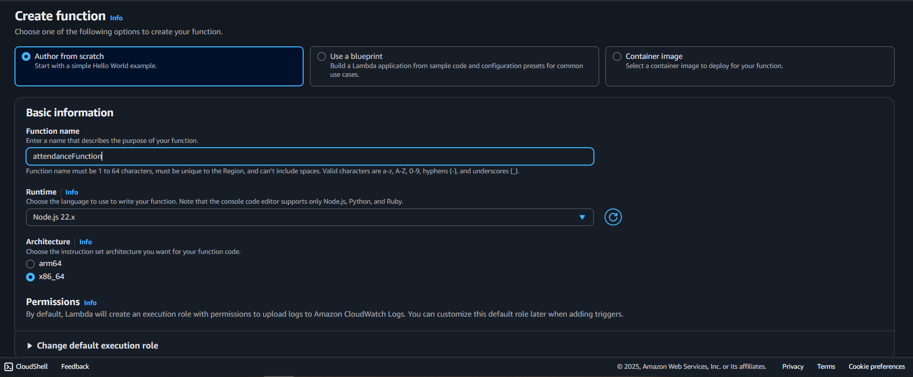
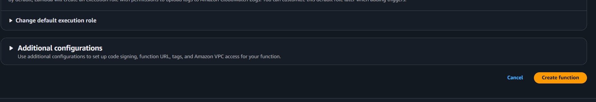
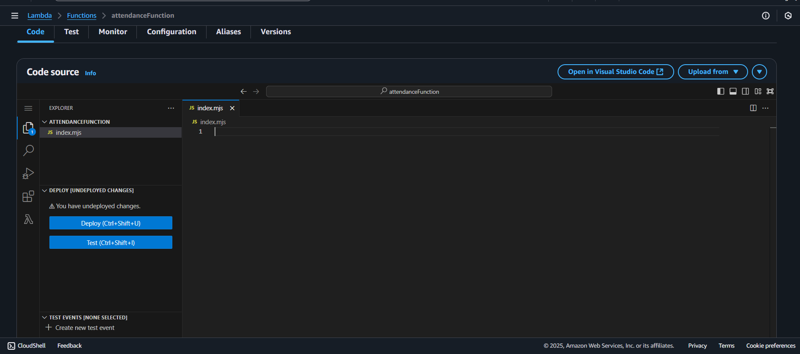
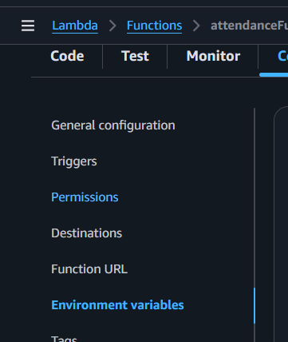
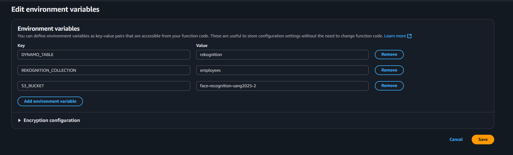
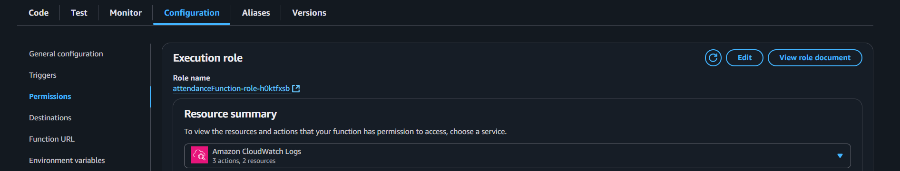
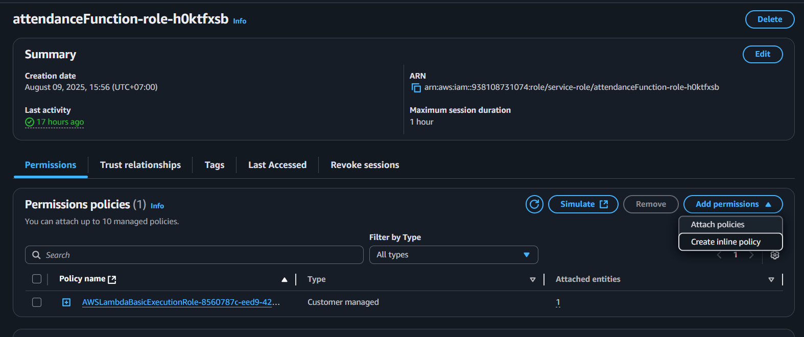

## Tổng quan

Trang này mô tả cách tạo hàm Lambda **`attendanceFunction`**.  
Nó được sử dụng để truy vấn dữ liệu điểm danh từ DynamoDB dựa trên kết quả từ bộ sưu tập Rekognition của bạn.

---

## Bước 1: Tạo hàm Lambda

1. Trong bảng điều khiển Lambda, điều hướng đến **Functions**.

2. Chọn **Create function**.

3. Trong phần **Author from scratch**:

   - **Function name:** `attendanceFunction`
   - **Runtime:** `Node.js 22.x`
   - **Architecture:** `x86_64`

Các cấu hình bổ sung khác có thể để mặc định.



4. Chọn **Create function**.



---

## Bước 2: Thêm mã hàm

1. Trong tab **Code**, thay thế mã mặc định bằng handler từ dự án Amplify của bạn:



Hoặc sao chép tệp `handler.js` từ:  
`Amplify/functions/attendanceFunction/handler.js`

```javascript
import { DynamoDBClient } from "@aws-sdk/client-dynamodb";
import { DynamoDBDocumentClient, QueryCommand } from "@aws-sdk/lib-dynamodb";

const dynamoClient = new DynamoDBClient({ region: process.env.AWS_REGION });
const ddbDocClient = DynamoDBDocumentClient.from(dynamoClient);

export const handler = async (event) => {
  try {
    const { externalImageId } = event.queryStringParameters || {};

    if (!externalImageId) {
      return {
        statusCode: 400,
        body: JSON.stringify({
          success: false,
          error: "Thiếu externalImageId",
        }),
      };
    }

    const today = new Date().toISOString().split("T")[0];

    const params = {
      TableName: process.env.DYNAMO_TABLE,
      KeyConditionExpression: "externalImageId = :pk AND checkinDay = :today",
      ExpressionAttributeValues: {
        ":pk": externalImageId,
        ":today": today,
      },
    };

    const result = await ddbDocClient.send(new QueryCommand(params));

    const items = result.Items || [];

    return {
      statusCode: 200,
      body: JSON.stringify({
        success: true,
        count: items.length,
        items,
      }),
    };
  } catch (err) {
    console.error("Lỗi khi truy vấn dữ liệu điểm danh hôm nay:", err);
    return {
      statusCode: 500,
      body: JSON.stringify({ success: false, error: err.message }),
    };
  }
};
```

Chọn **Deploy** (hoặc `Ctrl + Shift + U`) để lưu thay đổi của bạn.

---

## Bước 3: Cấu hình biến môi trường

1. Trong tab **Configuration**, chọn **Environment variables**.



2. Thêm các biến sau:

```ini
S3_BUCKET=TÊN_BUCKET_S3_CỦA_BẠN
REKOGNITION_COLLECTION=TÊN_BỘ_SƯU_TẬP_REKOGNITION_CỦA_BẠN
DYNAMO_TABLE=TÊN_BẢNG_DYNAMO_CỦA_BẠN
```



3. Lưu thay đổi.

---

## Bước 4: Gán quyền IAM

Hàm Lambda của bạn cần quyền để truy vấn dữ liệu từ bảng điểm danh DynamoDB của bạn.

1. Trong tab **Configuration**, vào **Permissions** và nhấp vào tên vai trò được gán cho hàm Lambda của bạn.



2. Trong IAM, chọn **Add permissions** → **Create inline policy**.



3. Chuyển sang chế độ xem **JSON** và dán:

```json
{
  "Version": "2012-10-17",
  "Statement": [
    {
      "Effect": "Allow",
      "Action": "dynamodb:Query",
      "Resource": "arn:aws:dynamodb:us-east-1:938108731074:table/${env:DYNAMO_TABLE}"
    }
  ]
}
```

{}
Thay `${env:DYNAMO_TABLE}` bằng tên bảng DynamoDB thực tế của bạn nếu trình chỉnh sửa chính sách IAM không hỗ trợ thay thế biến môi trường.
{}

4. Lưu chính sách và gán nó cho vai trò thực thi của Lambda.

---

Tại thời điểm này, **`attendanceFunction`** đã sẵn sàng để truy vấn các bản ghi điểm danh được lưu trữ trong bảng DynamoDB của bạn.
