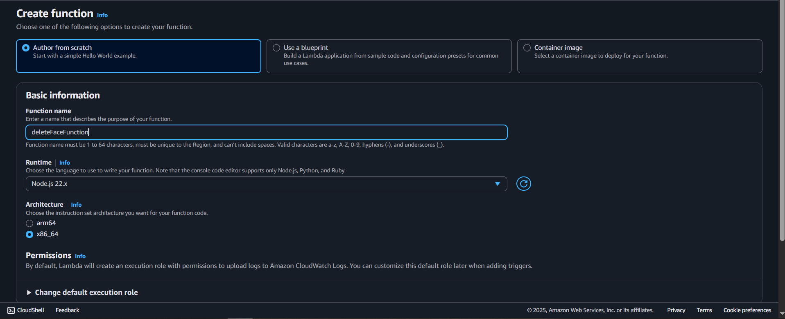
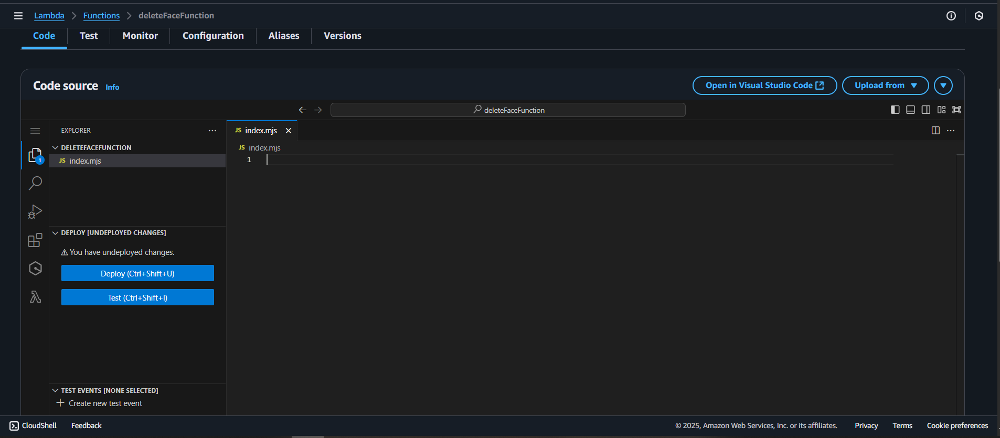

## Overview

This page describes how to create the **`deleteFaceFunction`** Lambda function.  
It is used to remove specific faces from an Amazon Rekognition collection and optionally delete related objects from an S3 bucket.

---

## Step 1: Create the Lambda function

1. Still in Lambda console, navigate to functions.

2. Choose **Create function**.

3. Under **Author from scratch**:

   - **Function name:** `deleteFaceFunction`
   - **Runtime:** `Node.js 22.x`
   - **Architecture:** `x86_64`

Other Additional configurations can be left alone.



4. Choose **Create function**.


---

## Step 2: Add the function code

1. In the **Code** tab, replace the default code with the handler from your Amplify project:



Or copy the `handler.js` file from:  
`Amplify/functions/deleteFaceFunction/handler.js`

```javascript
import { DeleteFacesCommand } from "@aws-sdk/client-rekognition";
import { DeleteObjectCommand } from "@aws-sdk/client-s3";
import { RekognitionClient } from "@aws-sdk/client-rekognition";
import { S3Client } from "@aws-sdk/client-s3";

export const CONSTANTS = {
  LIVENESS_CONFIDENCE_THRESHOLD: 85,
  FACE_MATCH_THRESHOLD: 70,
  MANUAL_CHECKIN_THRESHOLD: 90,
  PREVIEW_CLEANUP_DELAY: 5 * 60 * 1000, // 5 minutes
};

const clientConfig = {
  region: process.env.AWS_REGION || "us-east-1",
  credentials: {
    accessKeyId: process.env.AWS_ACCESS_KEY_ID,
    secretAccessKey: process.env.AWS_SECRET_ACCESS_KEY,
  },
};

export const s3Client = new S3Client(clientConfig);
export const rekognitionClient = new RekognitionClient(clientConfig);

class RekognitionService {
  static async deleteFaces(collectionId, faceIds) {
    const command = new DeleteFacesCommand({
      CollectionId: collectionId,
      FaceIds: faceIds,
    });

    return await rekognitionClient.send(command);
  }
}

class S3Service {
  static async deleteObject(bucket, key) {
    const command = new DeleteObjectCommand({
      Bucket: bucket,
      Key: key,
    });

    return await s3Client.send(command);
  }
}

export const handler = async (event) => {
  try {
    let body = event.body;

    // Nếu body là JSON string -> parse
    if (typeof body === "string") {
      try {
        body = JSON.parse(body);
      } catch {
        return {
          statusCode: 400,
          body: JSON.stringify({ success: false, error: "Invalid JSON body" }),
        };
      }
    }

    const { faceId, s3Key } = body || {};

    if (!faceId || !s3Key) {
      return {
        statusCode: 400,
        body: JSON.stringify({
          success: false,
          error: "Missing faceId or s3Key",
        }),
      };
    }

    // 1. Delete from Rekognition
    await RekognitionService.deleteFaces(process.env.REKOGNITION_COLLECTION, [
      faceId,
    ]);

    // 2. Delete from S3
    await S3Service.deleteObject(process.env.S3_BUCKET, s3Key);

    return {
      statusCode: 200,
      body: JSON.stringify({
        success: true,
        message: "Face and image deleted successfully",
      }),
    };
  } catch (err) {
    console.error("Error deleting face:", err);
    return {
      statusCode: 500,
      body: JSON.stringify({ success: false, error: err.message }),
    };
  }
};
```

Choose **Deploy** (or `Ctrl + Shift + U`) to save your changes.

---

## Step 3: Configure environment variables

1. In the **Configuration** tab, choose **Environment variables**.


2. Add the following:

```ini
S3_BUCKET=YOUR_S3_BUCKET_NAME
REKOGNITION_COLLECTION=YOUR_REKOGNITION_COLLECTION_NAME
DYNAMO_TABLE=YOUR_DYNAMO_TABLE_NAME
```


3. Save changes.

---

## Step 4: Assign IAM permissions

Your Lambda function needs permission to delete faces in a Rekognition collection and remove objects from S3.

1. Still in the **Configuration** tab, go to **Permissions** and click the role name attached to your Lambda function.


2. This will open the IAM console — choose **Add permissions** → **Create inline policy**.


3. Switch to **JSON** view and paste:

```json
{
  "Version": "2012-10-17",
  "Statement": [
    {
      "Effect": "Allow",
      "Action": "rekognition:DeleteFaces",
      "Resource": "arn:aws:rekognition:AWS_REGION:UserId:collection/ColectionName"
    },
    {
      "Effect": "Allow",
      "Action": "s3:DeleteObject",
      "Resource": "arn:aws:s3:::YOUR_S3_BUCKET_NAME/*"
    }
  ]
}
```

{}
Replace `YOUR_S3_BUCKET_NAME` with your actual bucket name.
The `arn:aws:s3:::` format should exactly match your bucket.
As well as `AWS REGION`, `UserId` (AWS Account ID) and `CollectionName` as your Rekognition collection name
{}

4. Save the policy and attach it to your Lambda execution role.

---

At this point, **`deleteFaceFunction`** is ready to be integrated into your system to remove specific faces and associated objects.
