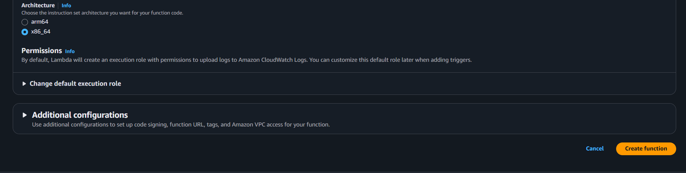
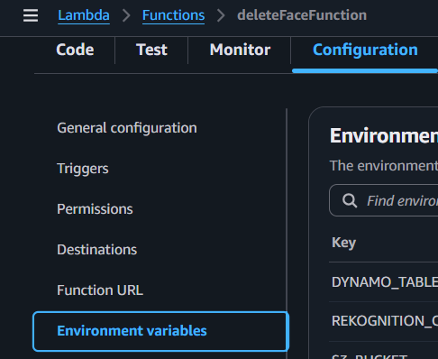

## Tổng quan

Trang này mô tả cách tạo hàm Lambda **`deleteFaceFunction`**.  
Nó được sử dụng để xóa các khuôn mặt cụ thể khỏi bộ sưu tập Amazon Rekognition và tùy chọn xóa các đối tượng liên quan khỏi S3 bucket.

---

## Bước 1: Tạo hàm Lambda

1. Vẫn ở trong bảng điều khiển Lambda, điều hướng đến **Functions**.

2. Chọn **Create function**.

3. Trong phần **Author from scratch**:

   - **Function name:** `deleteFaceFunction`
   - **Runtime:** `Node.js 22.x`
   - **Architecture:** `x86_64`

Các cấu hình bổ sung khác có thể để mặc định.


4. Chọn **Create function**.



---

## Bước 2: Thêm mã hàm

1. Trong tab **Code**, thay thế mã mặc định bằng handler từ dự án Amplify của bạn:


Hoặc sao chép tệp `handler.js` từ:  
`Amplify/functions/deleteFaceFunction/handler.js`

```javascript
import { DeleteFacesCommand } from "@aws-sdk/client-rekognition";
import { DeleteObjectCommand } from "@aws-sdk/client-s3";
import { RekognitionClient } from "@aws-sdk/client-rekognition";
import { S3Client } from "@aws-sdk/client-s3";

export const CONSTANTS = {
  LIVENESS_CONFIDENCE_THRESHOLD: 85,
  FACE_MATCH_THRESHOLD: 70,
  MANUAL_CHECKIN_THRESHOLD: 90,
  PREVIEW_CLEANUP_DELAY: 5 * 60 * 1000, // 5 phút
};

const clientConfig = {
  region: process.env.AWS_REGION || "us-east-1",
  credentials: {
    accessKeyId: process.env.AWS_ACCESS_KEY_ID,
    secretAccessKey: process.env.AWS_SECRET_ACCESS_KEY,
  },
};

export const s3Client = new S3Client(clientConfig);
export const rekognitionClient = new RekognitionClient(clientConfig);

class RekognitionService {
  static async deleteFaces(collectionId, faceIds) {
    const command = new DeleteFacesCommand({
      CollectionId: collectionId,
      FaceIds: faceIds,
    });

    return await rekognitionClient.send(command);
  }
}

class S3Service {
  static async deleteObject(bucket, key) {
    const command = new DeleteObjectCommand({
      Bucket: bucket,
      Key: key,
    });

    return await s3Client.send(command);
  }
}

export const handler = async (event) => {
  try {
    let body = event.body;

    // Nếu body là JSON string -> parse
    if (typeof body === "string") {
      try {
        body = JSON.parse(body);
      } catch {
        return {
          statusCode: 400,
          body: JSON.stringify({
            success: false,
            error: "JSON body không hợp lệ",
          }),
        };
      }
    }

    const { faceId, s3Key } = body || {};

    if (!faceId || !s3Key) {
      return {
        statusCode: 400,
        body: JSON.stringify({
          success: false,
          error: "Thiếu faceId hoặc s3Key",
        }),
      };
    }

    // 1. Xóa khỏi Rekognition
    await RekognitionService.deleteFaces(process.env.REKOGNITION_COLLECTION, [
      faceId,
    ]);

    // 2. Xóa khỏi S3
    await S3Service.deleteObject(process.env.S3_BUCKET, s3Key);

    return {
      statusCode: 200,
      body: JSON.stringify({
        success: true,
        message: "Đã xóa khuôn mặt và ảnh thành công",
      }),
    };
  } catch (err) {
    console.error("Lỗi khi xóa khuôn mặt:", err);
    return {
      statusCode: 500,
      body: JSON.stringify({ success: false, error: err.message }),
    };
  }
};
```

Chọn **Deploy** (hoặc `Ctrl + Shift + U`) để lưu thay đổi của bạn.

---

## Bước 3: Cấu hình biến môi trường

1. Trong tab **Configuration**, chọn **Environment variables**.



2. Thêm các biến sau:

```ini
S3_BUCKET=TÊN_BUCKET_S3_CỦA_BẠN
REKOGNITION_COLLECTION=TÊN_BỘ_SƯU_TẬP_REKOGNITION_CỦA_BẠN
DYNAMO_TABLE=TÊN_BẢNG_DYNAMO_CỦA_BẠN
```


3. Lưu thay đổi.

---

## Bước 4: Gán quyền IAM

Hàm Lambda của bạn cần quyền để xóa khuôn mặt trong bộ sưu tập Rekognition và xóa đối tượng khỏi S3.

1. Vẫn trong tab **Configuration**, vào **Permissions** và nhấp vào tên vai trò được gán cho hàm Lambda của bạn.


2. Điều này sẽ mở bảng điều khiển IAM — chọn **Add permissions** → **Create inline policy**.


3. Chuyển sang chế độ xem **JSON** và dán:

```json
{
  "Version": "2012-10-17",
  "Statement": [
    {
      "Effect": "Allow",
      "Action": "rekognition:DeleteFaces",
      "Resource": "arn:aws:rekognition:AWS_REGION:UserId:collection/ColectionName"
    },
    {
      "Effect": "Allow",
      "Action": "s3:DeleteObject",
      "Resource": "arn:aws:s3:::YOUR_S3_BUCKET_NAME/*"
    }
  ]
}
```

{}
Thay `YOUR_S3_BUCKET_NAME` bằng tên bucket thực tế của bạn.  
Định dạng `arn:aws:s3:::` phải khớp chính xác với bucket của bạn.  
Cũng như `AWS REGION`, `UserId` (AWS Account ID) và `CollectionName` với tên bộ sưu tập Rekognition của bạn.
{}

4. Lưu chính sách và gán nó cho vai trò thực thi của Lambda.

---

Tại thời điểm này, **`deleteFaceFunction`** đã sẵn sàng để tích hợp vào hệ thống của bạn nhằm xóa các khuôn mặt cụ thể và các đối tượng liên quan.
