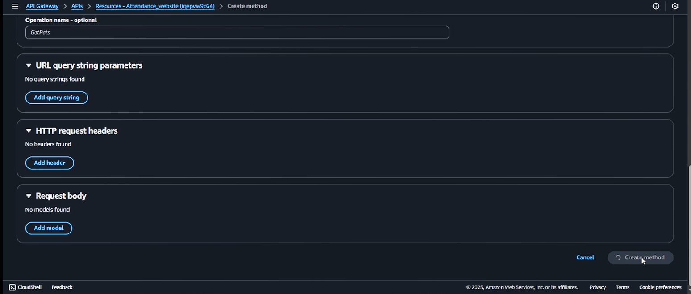
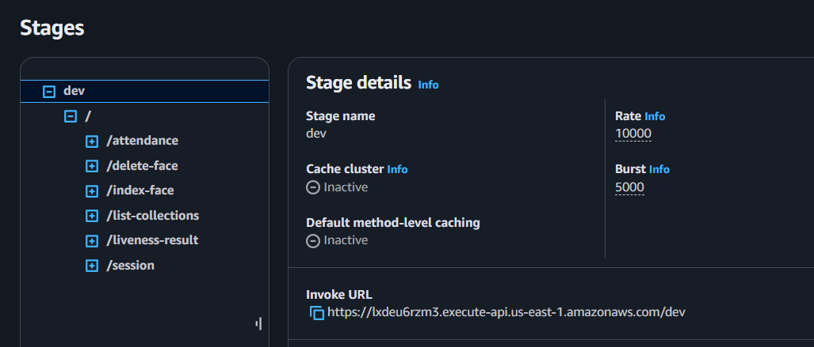

## Deploy Lambda Functions to API Gateway

Follow the steps below to expose your Lambda functions as REST API endpoints in API Gateway.

---

### Step 0 – Create New API

1. Navigate to **API Gateway** in the AWS Console.


2. Select **APIs** → **REST API** → **Build**.


3. Choose:
   - **New API**
   - **Name**: _Example: Face Recognition API_
   - **Description**: _Optional description_
4. Click **Create API**.


---

### Step 1 – Create Resources

For each Lambda function, you will create a **Resource** in API Gateway.

1. Click **Create Resource** at the original path (/).


2. **Resource Path**: Leave as generated.
3. **Resource Name**: Match the route (example: `/session`, `/index-face`).
4. Enable **CORS**.
5. Click **Create Resource**.


---

### Step 2 – Create Methods

1. Select the **correct resource** from the left panel.  
   

2. Click **Create Method**.


3. Select the method type (**POST**, **GET**, or **DELETE**).  
   

4. Under **Integration type**, select **Lambda Function**.


5. Enable **Lambda Proxy Integration**.


6. Select your **Region**.

7. Enter the **Lambda function name** corresponding to the route.


8. Keep **Timeout** at **29000 ms**.

9. Leave **Authorization** and other settings at default.

10. Click **Save**.



---

## Route to Lambda Mapping

```javascript
import { handler as createSessionHandler } from "../../amplify/functions/sessionFunction/handler.js";
router.get("/session", lambdaToExpress(createSessionHandler));

import { handler as getSessionResultsHandler } from "../../amplify/functions/livenessResultFunction/handler.js";
router.get(
  "/liveness-result/:sessionId",
  validateSessionId,
  lambdaToExpress(getSessionResultsHandler)
);

import { handler as indexFaceHandler } from "../../amplify/functions/indexFaceFunction/handler.js";
router.post(
  "/index-face",
  upload.single("photo"),
  lambdaToExpress(indexFaceHandler)
);

import { handler as listCollectionHandler } from "../../amplify/functions/listCollectionFunction/handler.js";
router.get("/list-collections", lambdaToExpress(listCollectionHandler));

import { handler as deleteFaceHandler } from "../../amplify/functions/deleteFaceFunction/handler.js";
router.delete(
  "/delete-face",
  express.json(),
  lambdaToExpress(deleteFaceHandler)
);

import { handler as getAttendanceHandler } from "../../amplify/functions/attendanceFunction/handler.js";
router.get("/attendance", lambdaToExpress(getAttendanceHandler));
```

---

## API Gateway Setup – Resource and Method Table

| Resource Path       | Method(s)       | Lambda Function Name     |
| ------------------- | --------------- | ------------------------ |
| `/session`          | **GET**         | `sessionFunction`        |
| `/liveness-result`  | **GET** (twice) | `livenessResultFunction` |
| `/index-face`       | **POST**        | `indexFaceFunction`      |
| `/list-collections` | **GET**         | `listCollectionFunction` |
| `/delete-face`      | **DELETE**      | `deleteFaceFunction`     |
| `/attendance`       | **GET**         | `attendanceFunction`     |

---

### Special Note – `/liveness-result`

Create this route **two times**:

- `/liveness-result` (resource)
- `/liveness-result/{sessionId}` (resource with path parameter)
  Both point to the **livenessResultFunction** Lambda.


---

### Step 3 – Repeat for All Endpoints

Repeat **Step 1** and **Step 2** for all routes listed in the table.

---

### Step 4 – Deploy API

1. In API Gateway, click **Actions** → **Deploy API**.


2. Create a new stage (example: `dev`) or select an existing stage.

3. Click **Deploy**.

4. Copy the **Invoke URL**



5. Now, you can go and set the url in your frontend folder `.env` file as `VITE_API_BASE_URL`.

---

## Example Invoke URLs

- `GET {{invoke_url}}/session`
- `GET {{invoke_url}}/liveness-result/{sessionId}`
- `POST {{invoke_url}}/index-face`
- `GET {{invoke_url}}/list-collections`
- `DELETE {{invoke_url}}/delete-face`
- `GET {{invoke_url}}/attendance`

And congratualtion! You have set your API Gateway up with the correct routes and Lambda functions. You can now use the API Gateway to interact, even localhost.
