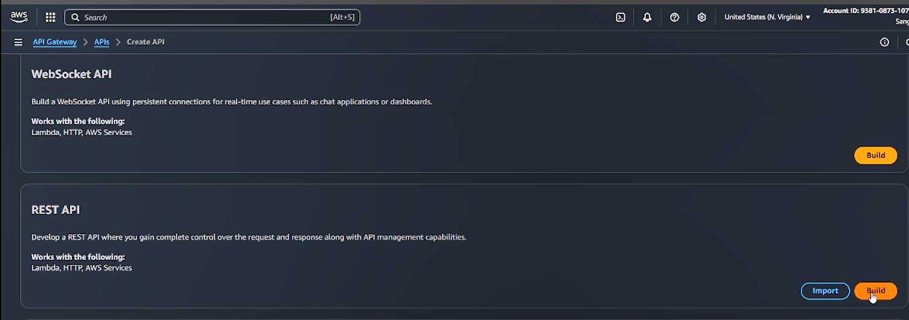
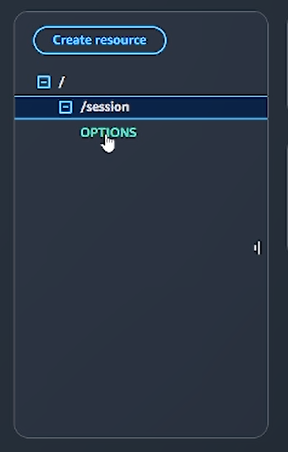
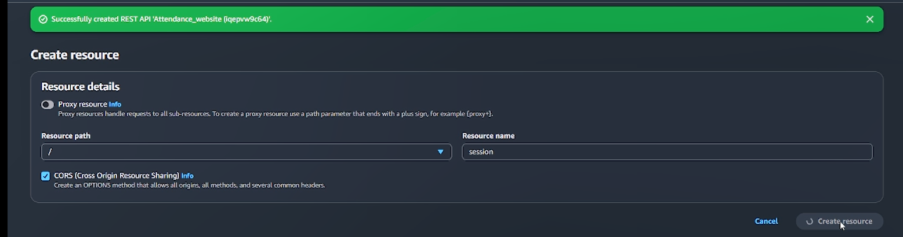
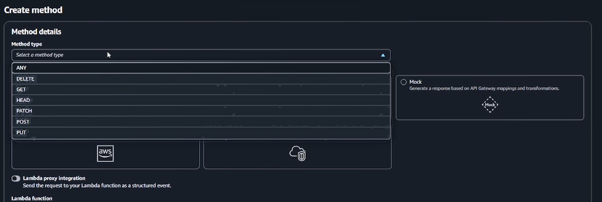
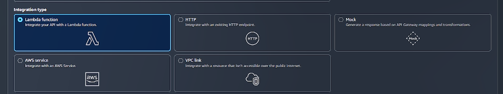
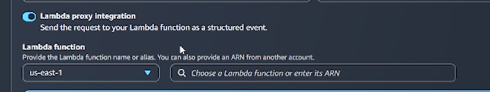
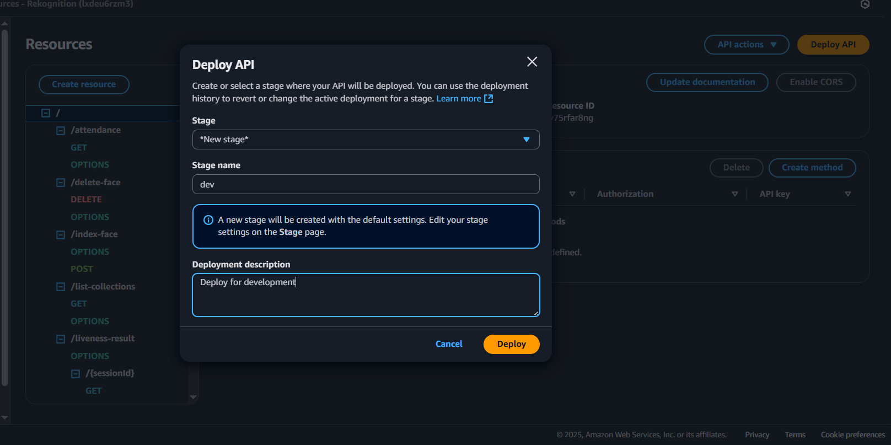

## Triển khai Chức năng Lambda đến API Gateway

Thực hiện theo các bước dưới đây để triển khai các hàm Lambda của bạn dưới dạng các endpoint REST API trong API Gateway.

---

### Bước 0 – Tạo API Mới

1. Điều hướng đến **API Gateway** trong AWS Console.


2. Chọn **APIs** → **REST API** → **Build**.



3. Chọn:
   - **New API**
   - **Name**: _Ví dụ: Face Recognition API_
   - **Description**: _Mô tả tùy chọn_
4. Nhấp **Create API**.


---

### Bước 1 – Tạo Resources

Đối với mỗi hàm Lambda, bạn sẽ tạo một **Resource** trong API Gateway.

1. Nhấp **Create Resource** tại đường dẫn gốc (/).



2. **Resource Path**: Để nguyên như được tạo.
3. **Resource Name**: Khớp với route (ví dụ: `/session`, `/index-face`).
4. Bật **CORS**.
5. Nhấp **Create Resource**.



---

### Bước 2 – Tạo Methods

1. Chọn **resource đúng** từ bảng điều khiển bên trái.  
   

2. Nhấp **Create Method**.


3. Chọn loại method (**POST**, **GET**, hoặc **DELETE**).  
   

4. Dưới **Integration type**, chọn **Lambda Function**.



5. Bật **Lambda Proxy Integration**.



6. Chọn **Region** của bạn.

7. Nhập **tên hàm Lambda** tương ứng với route.


8. Giữ **Timeout** ở mức **29000 ms**.

9. Để **Authorization** và các cài đặt khác ở mặc định.

10. Nhấp **Save**.


---

## Ánh xạ Route đến Lambda

```javascript
import { handler as createSessionHandler } from "../../amplify/functions/sessionFunction/handler.js";
router.get("/session", lambdaToExpress(createSessionHandler));

import { handler as getSessionResultsHandler } from "../../amplify/functions/livenessResultFunction/handler.js";
router.get(
  "/liveness-result/:sessionId",
  validateSessionId,
  lambdaToExpress(getSessionResultsHandler)
);

import { handler as indexFaceHandler } from "../../amplify/functions/indexFaceFunction/handler.js";
router.post(
  "/index-face",
  upload.single("photo"),
  lambdaToExpress(indexFaceHandler)
);

import { handler as listCollectionHandler } from "../../amplify/functions/listCollectionFunction/handler.js";
router.get("/list-collections", lambdaToExpress(listCollectionHandler));

import { handler as deleteFaceHandler } from "../../amplify/functions/deleteFaceFunction/handler.js";
router.delete(
  "/delete-face",
  express.json(),
  lambdaToExpress(deleteFaceHandler)
);

import { handler as getAttendanceHandler } from "../../amplify/functions/attendanceFunction/handler.js";
router.get("/attendance", lambdaToExpress(getAttendanceHandler));
```

---

## Cài đặt API Gateway – Bảng Resource và Method

| Resource Path       | Method(s)         | Lambda Function Name     |
| ------------------- | ----------------- | ------------------------ |
| `/session`          | **GET**           | `sessionFunction`        |
| `/liveness-result`  | **GET** (hai lần) | `livenessResultFunction` |
| `/index-face`       | **POST**          | `indexFaceFunction`      |
| `/list-collections` | **GET**           | `listCollectionFunction` |
| `/delete-face`      | **DELETE**        | `deleteFaceFunction`     |
| `/attendance`       | **GET**           | `attendanceFunction`     |

---

### Ghi chú Đặc biệt – `/liveness-result`

Tạo route này **hai lần**:

- `/liveness-result` (resource)
- `/liveness-result/{sessionId}` (resource với tham số đường dẫn)
  Cả hai đều trỏ đến hàm Lambda **livenessResultFunction**.


---

### Bước 3 – Lặp lại cho Tất cả các Endpoint

Lặp lại **Bước 1** và **Bước 2** cho tất cả các route được liệt kê trong bảng.

---

### Bước 4 – Triển khai API

1. Trong API Gateway, nhấp **Actions** → **Deploy API**.



2. Tạo một stage mới (ví dụ: `dev`) hoặc chọn stage hiện có.

3. Nhấp **Deploy**.

4. Sao chép **Invoke URL**


5. Bây giờ, bạn có thể đi và đặt url trong file `.env` của thư mục frontend dưới dạng `VITE_API_BASE_URL`.

---

## Ví dụ Invoke URLs

- `GET {{invoke_url}}/session`
- `GET {{invoke_url}}/liveness-result/{sessionId}`
- `POST {{invoke_url}}/index-face`
- `GET {{invoke_url}}/list-collections`
- `DELETE {{invoke_url}}/delete-face`
- `GET {{invoke_url}}/attendance`

Và chúc mừng! Bạn đã thiết lập API Gateway của mình với các route đúng và các hàm Lambda. Bây giờ bạn có thể sử dụng API Gateway để tương tác, thậm chí localhost.
