## **Deploy React/Vite Frontend to S3 + CloudFront**

---

### **Step 1 — Create S3 Bucket**

1. Go to **AWS Console → S3 → Create bucket**.
2. **Bucket name:**
   Give it a **unique name** (e.g., `my-frontend-app-bucket`).
   _(This is the only field you change — keep all other settings default.)_

   

3. Leave:

   - AWS Region → Default or your choice
   - Object Ownership → ACLs disabled
   - Block Public Access → Keep as default
   - Versioning, Encryption, Tags → default

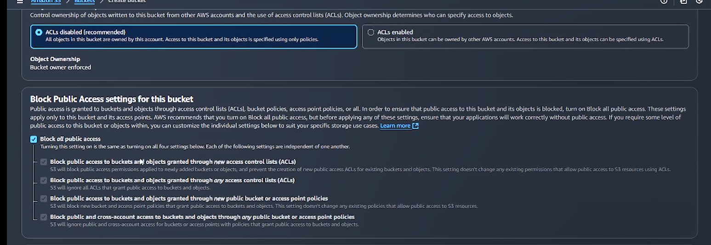

4. Click **Create bucket**.


---

### **Step 2 — Create CloudFront Distribution**

1. Go to **AWS Console → CloudFront → Create distribution**.

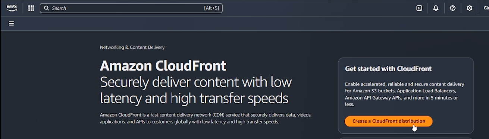

Then enter your Distribution name


2. **Origin type:** Select **S3**.

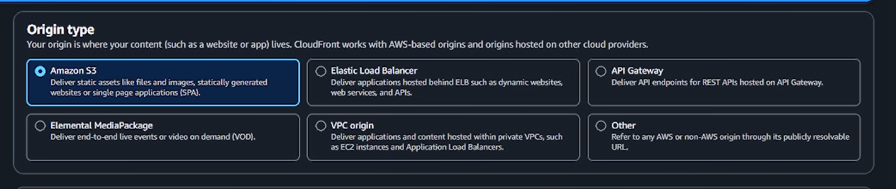

3. Choose the S3 bucket you just created.

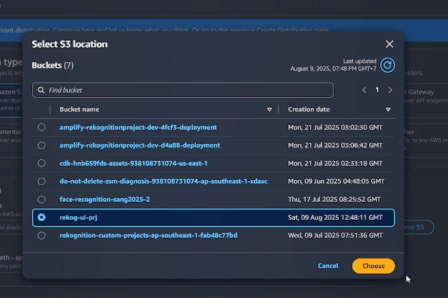

4. Keep **all other settings default**:


- Viewer protocol policy → Redirect HTTP to HTTPS
- Cache settings → Use origin cache headers
- Logging → Off

5. Click **Next**.
6. **Web Application Firewall (WAF):** Select **Do not enable**.

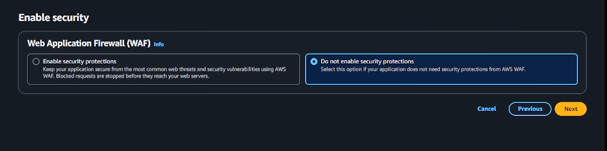

7. Click **Next**.
8. Review → Click **Create distribution**.


---

### **Step 3 — Set Default Root Object**

1. Go to your new CloudFront distribution.
2. **Settings → Edit**.


3. **Default root object:** `index.html`

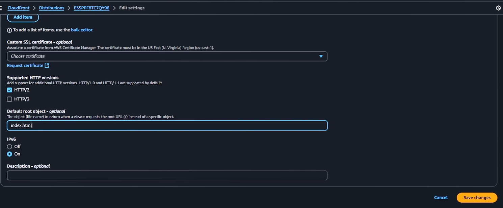

4. Save changes.

---

### **Step 4 — Build Your Frontend**

From your local project:

```bash
cd frontend
npm run build
```

This will generate your build output in `dist/` (Vite) or `build/` (React).

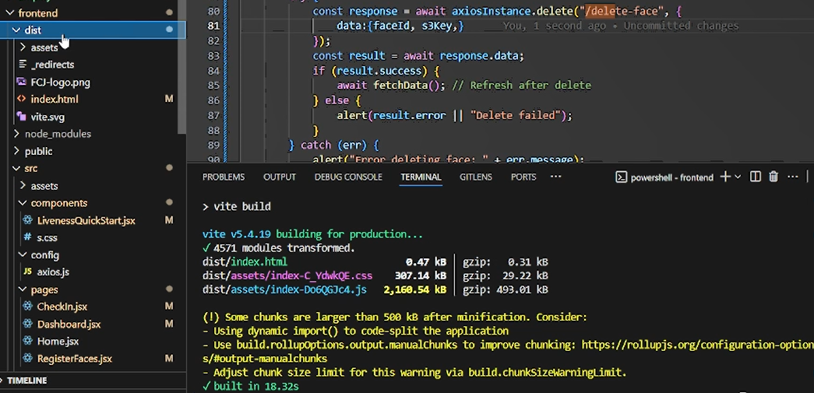

---

### **Step 5 — Upload to S3**

1. Copy everything inside the `dist/` folder (not the folder itself).
2. Go to **S3 bucket → Upload**.

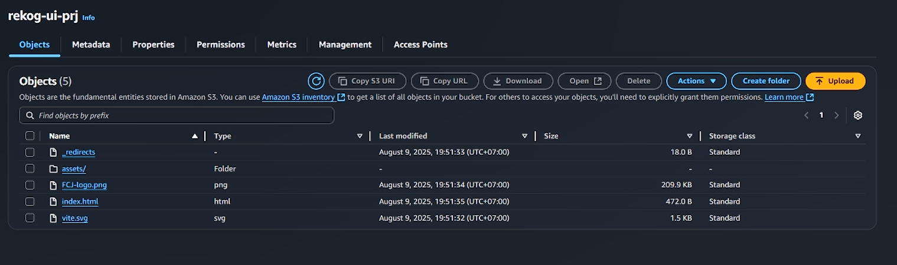

3. Drag-and-drop files, leave permissions default, click **Upload**.

---

### **Step 6 — Wait for CloudFront Propagation**

- It may take **a few minutes** for CloudFront to update.

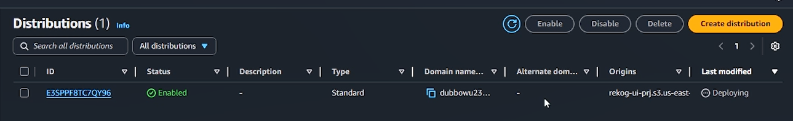

- Once done, go to **CloudFront → Your Distribution → Copy the Distribution Domain Name** (not the ARN).

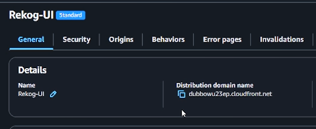

- Paste that into your browser to access your site.

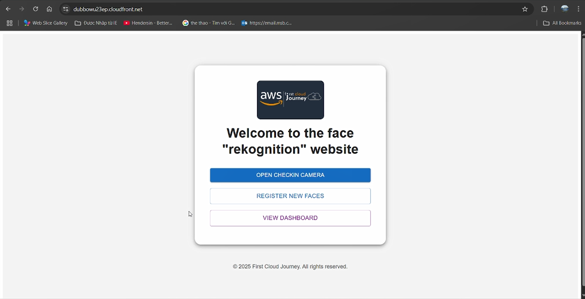

And that's it! You've successfully set up a serverless frontend with Vite and deployed it to AWS using CloudFront and S3. You can now watch your site update in real-time as you make changes to your code. Happy AWS coding, and thank you so much for doing this workshop until now!
