## **Triển khai Frontend React/Vite đến S3 + CloudFront**

---

### **Bước 1 — Tạo S3 Bucket**

1. Truy cập **AWS Console → S3 → Create bucket**.
2. **Bucket name:**
   Đặt một **tên duy nhất** (ví dụ: `my-frontend-app-bucket`).
   _(Đây là trường duy nhất bạn thay đổi — giữ tất cả các cài đặt khác ở mặc định.)_

   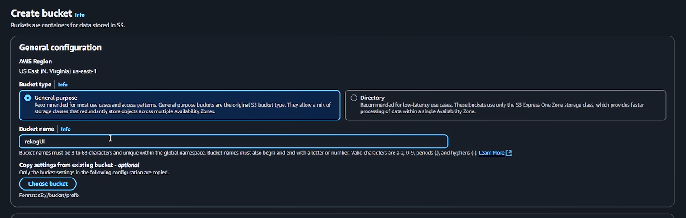

3. Để nguyên:

   - AWS Region → Mặc định hoặc tùy chọn của bạn
   - Object Ownership → ACLs disabled
   - Block Public Access → Giữ mặc định
   - Versioning, Encryption, Tags → mặc định

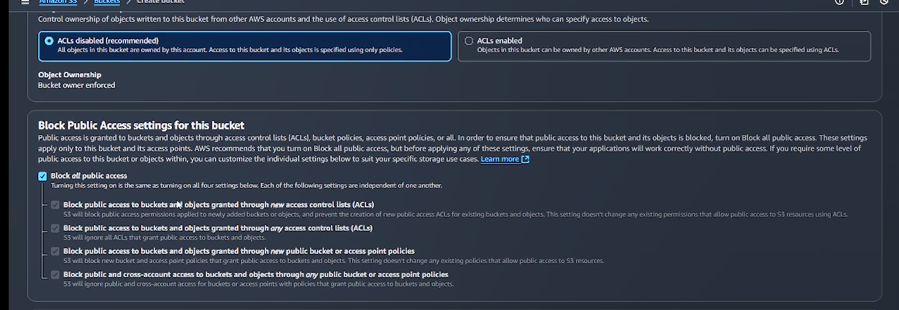

4. Nhấp **Create bucket**.

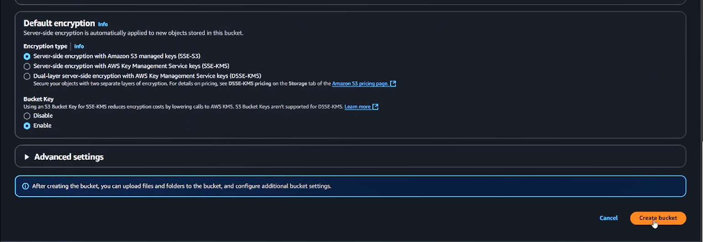

---

### **Bước 2 — Tạo CloudFront Distribution**

1. Truy cập **AWS Console → CloudFront → Create distribution**.

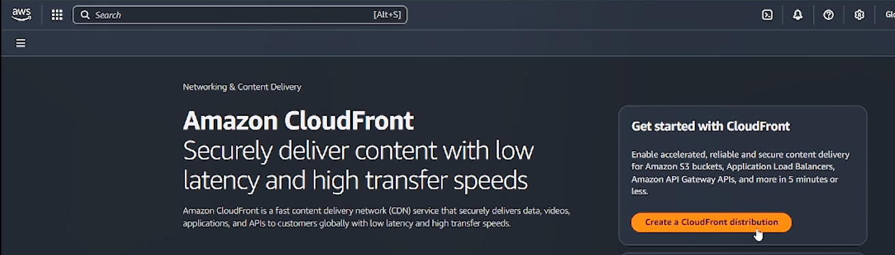

Sau đó nhập tên Distribution của bạn

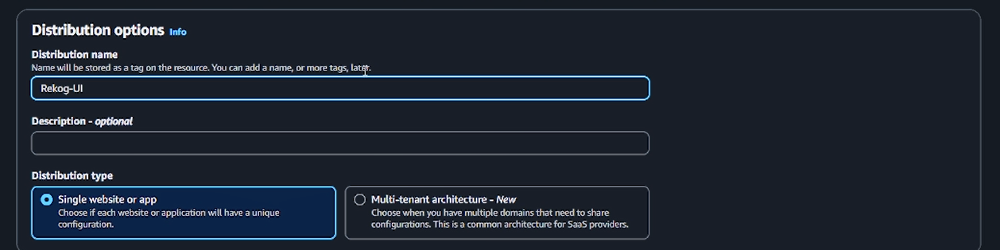

2. **Origin type:** Chọn **S3**.

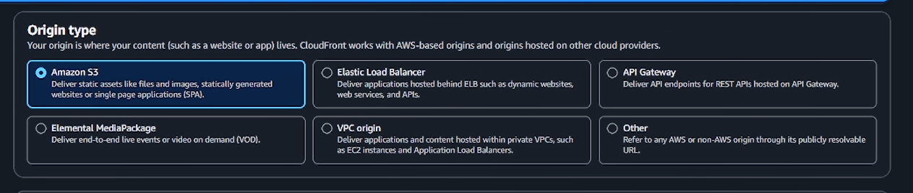

3. Chọn S3 bucket bạn vừa tạo.

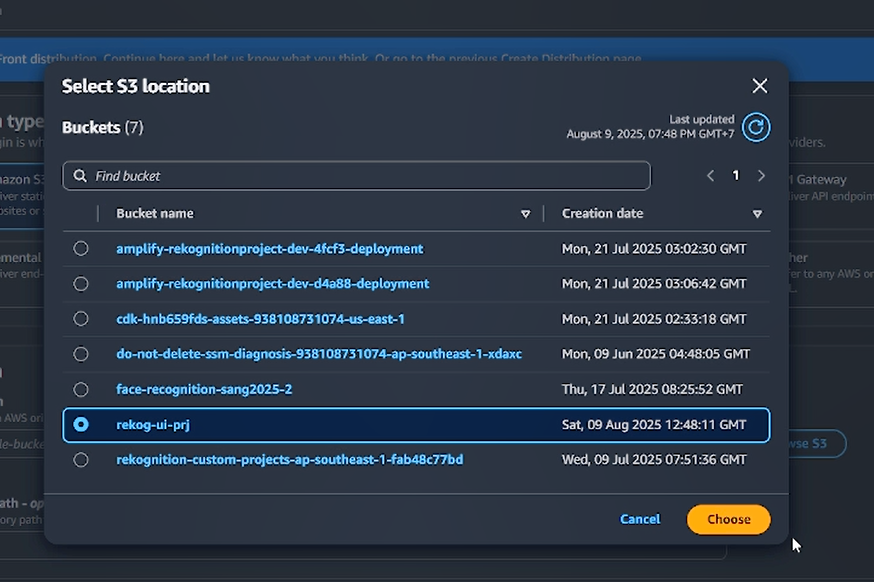

4. Giữ **tất cả các cài đặt khác ở mặc định**:

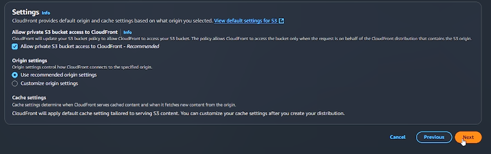

- Viewer protocol policy → Redirect HTTP to HTTPS
- Cache settings → Use origin cache headers
- Logging → Off

5. Nhấp **Next**.
6. **Web Application Firewall (WAF):** Chọn **Do not enable**.

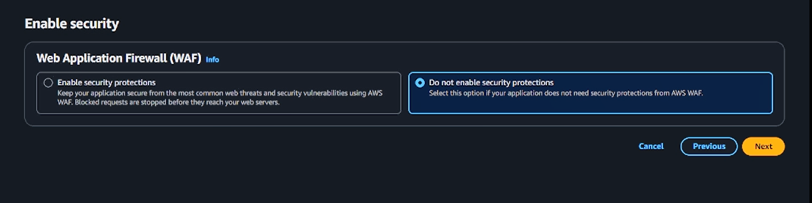

7. Nhấp **Next**.
8. Xem lại → Nhấp **Create distribution**.

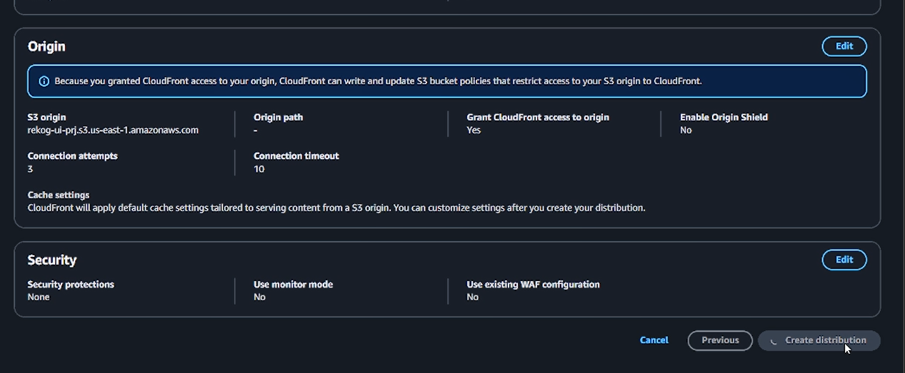

---

### **Bước 3 — Thiết lập Default Root Object**

1. Truy cập CloudFront distribution mới của bạn.
2. **Settings → Edit**.

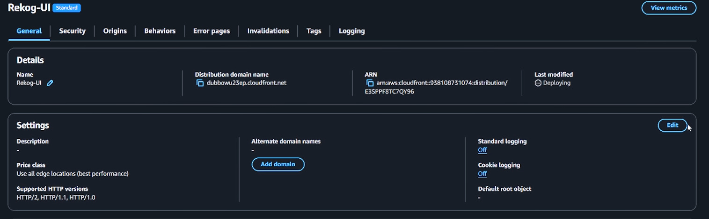

3. **Default root object:** `index.html`

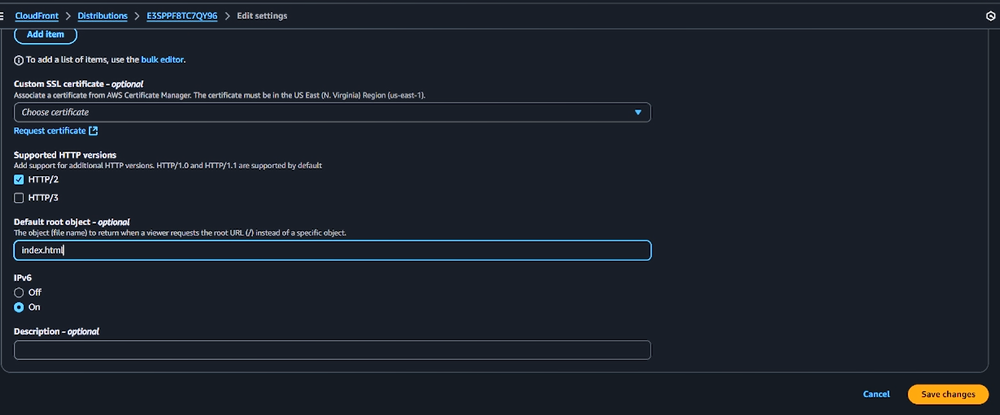

4. Lưu thay đổi.

---

### **Bước 4 — Build Frontend của Bạn**

Từ dự án cục bộ của bạn:

```bash
cd frontend
npm run build
```

Điều này sẽ tạo ra đầu ra build trong thư mục `dist/` (Vite) hoặc `build/` (React).

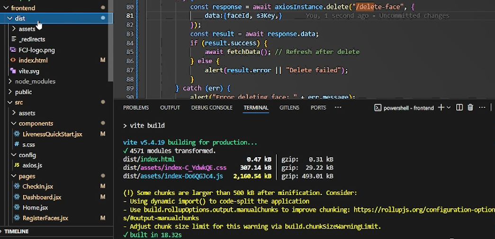

---

### **Bước 5 — Tải lên S3**

1. Sao chép mọi thứ bên trong thư mục `dist/` (không phải chính thư mục đó).
2. Truy cập **S3 bucket → Upload**.

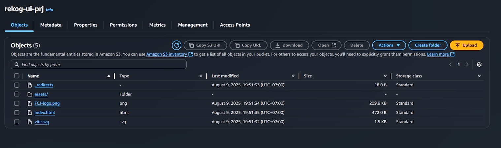

3. Kéo và thả các file, giữ nguyên quyền mặc định, nhấp **Upload**.

---

### **Bước 6 — Chờ CloudFront Propagation**

- Có thể mất **vài phút** để CloudFront cập nhật.

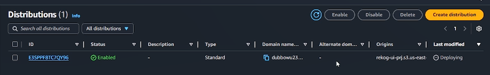

- Khi hoàn tất, truy cập **CloudFront → Your Distribution → Copy the Distribution Domain Name** (không phải ARN).

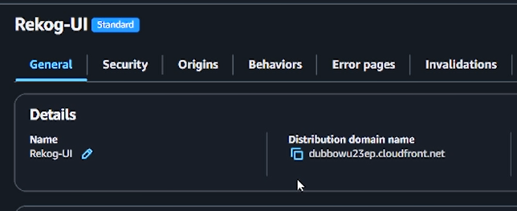

- Dán vào trình duyệt của bạn để truy cập trang web.

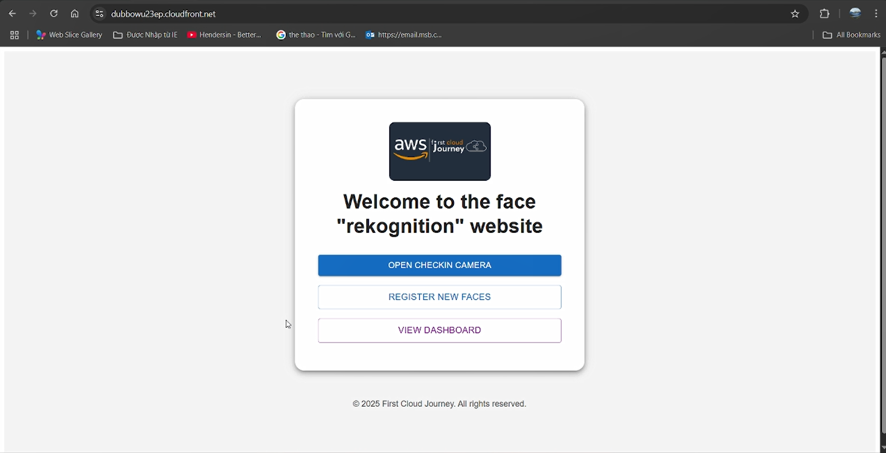

Và thế là xong! Bạn đã thiết lập thành công một frontend serverless với Vite và triển khai nó lên AWS bằng CloudFront và S3. Bây giờ bạn có thể xem trang web của mình cập nhật trong thời gian thực khi bạn thực hiện các thay đổi trong mã. Chúc bạn coding vui vẻ với AWS, và cảm ơn bạn rất nhiều vì đã tham gia workshop này cho đến bây giờ!
