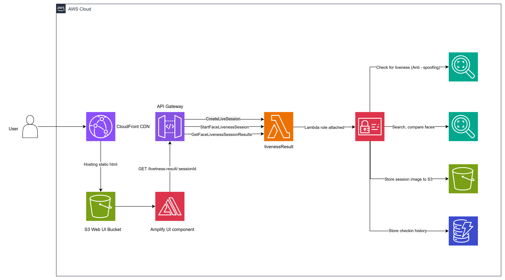

# Điểm danh khuôn mặt với chống giả mạo sử dụng AWS Rekognition, qua Amplify

### Tổng quan

Bài lab này giới thiệu một hệ thống điểm danh khuôn mặt kết hợp **AWS Rekognition** và **Amplify** để xác minh danh tính người dùng bằng cách sử dụng phát hiện người thật thời gian thực và so khớp khuôn mặt.  
Hệ thống loại bỏ giả mạo (anti- spoofing) bằng cách yêu cầu sự hiện diện người thật trước khi so khớp khuôn mặt của họ với một collection được lưu trữ.

Quy trình cốt lõi bao gồm:

- **Kiểm tra người thật** sử dụng `FaceLivenessDetector`
- **So khớp khuôn mặt** sử dụng `CompareFaces` và `SearchFacesByImage`
- **Giao diện người dùng** được xây dựng với React và Amplify
- **Hậu cảnh** sử dụng Express và AWS SDK

Dưới đây là kiến trúc của một phiên trực tiếp (khi triển khai không máy chủ)

### Nội dung

1. Tổng quan về mục tiêu dự án, kiến trúc, và các tính năng Rekognition được sử dụng.

2. Thiết lập môi trường phát triển và AWS của bạn:

   - Cài đặt **Node.js** và **npm**
   - Cài đặt và cấu hình **AWS CLI** (`aws configure`)
   - Cài đặt **Amplify CLI** (`npm install -g @aws-amplify/cli`)
   - Khởi tạo Amplify (`amplify init`)
   - Kích hoạt **Face Liveness** trong Amplify
   - Tạo một **collection Rekognition**, **bucket S3**, và các **vai trò IAM** cần thiết

3. Tích hợp Amplify để ghi lại các phiên người dùng trực tiếp trong trình duyệt.

4. Tạo và thiết lập S3 đúng cách để Rekognition kết nối.

5. Xây dựng logic điểm danh hoàn chỉnh: từ phát hiện người thật ở giao diện → đến so khớp ở hậu cảnh → đến ghi lại điểm danh (ví dụ, trong DynamoDB).

6. Triển khai cục bộ, sau đó đến Amplify để triển khai không máy chủ.

7. Triển khai các hàm Lambda đến API Gateway để công khai chúng dưới dạng API REST.

8. Triển khai giao diện người dùng đến S3 + CloudFront Hosting.

9. Dọn dẹp tài nguyên để tránh chi phí không cần thiết.
